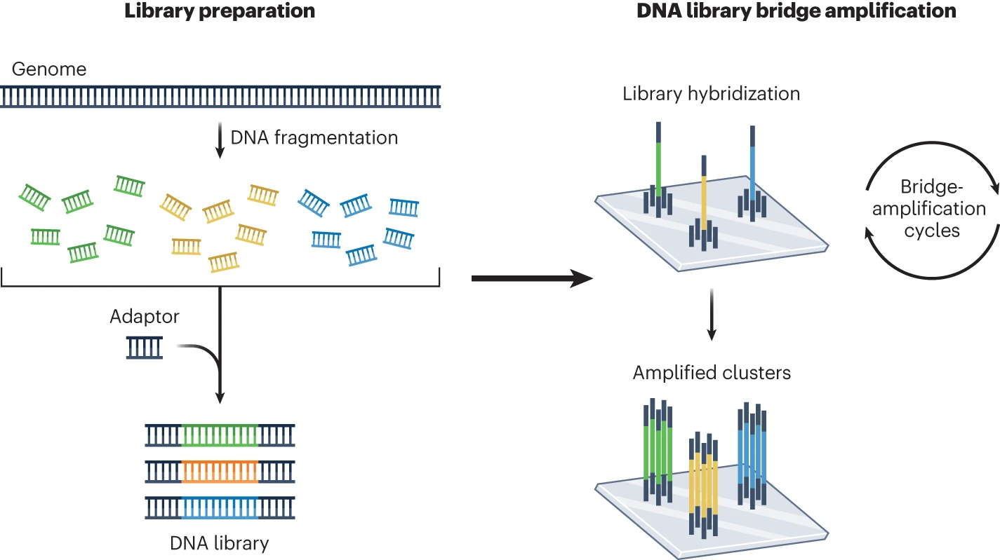
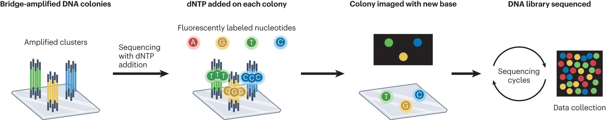
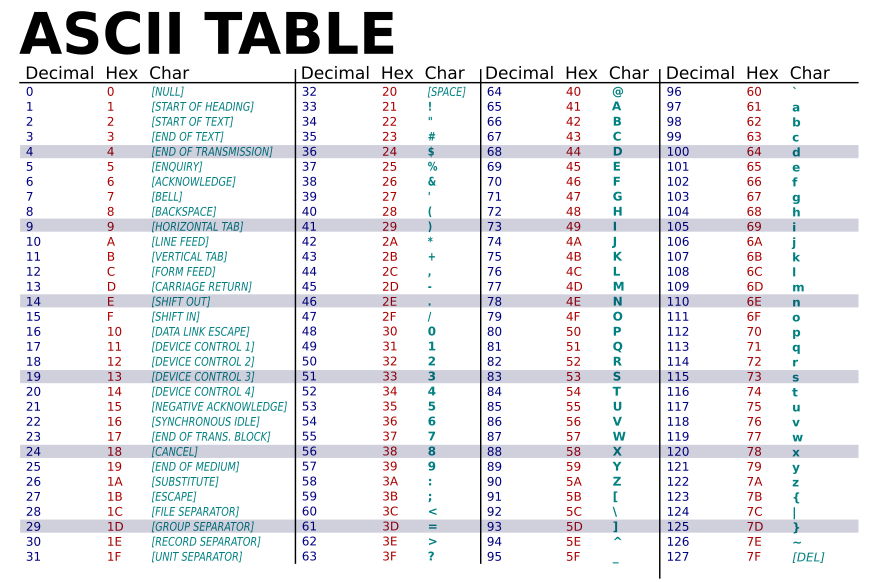
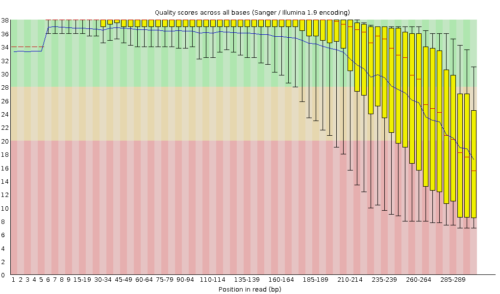
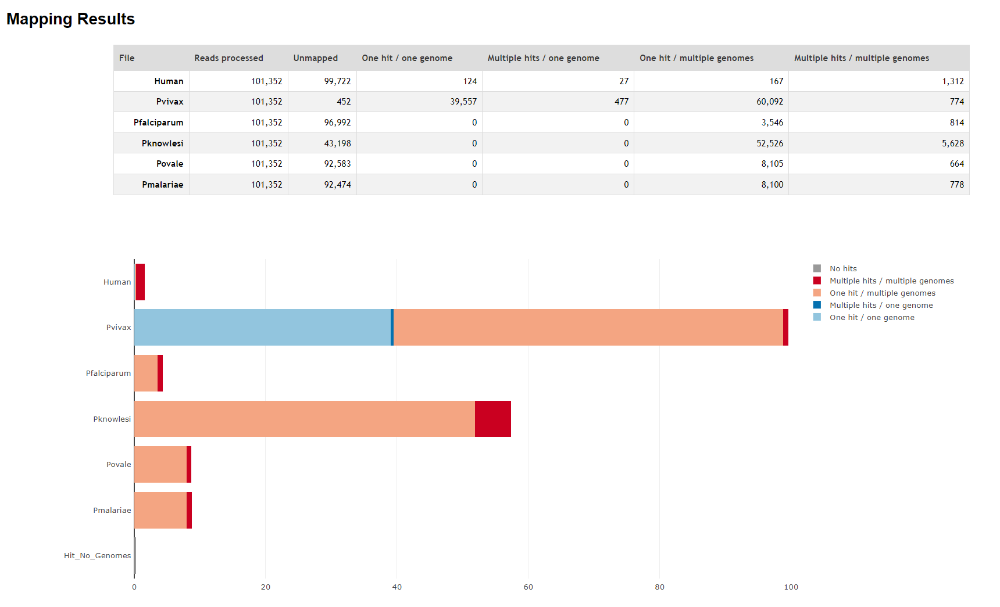

# Quality control and trimming {#sec-qc}

The first step in our pipeline deals with assessing the quality of our sequence reads and when necessary cleaning them. The reads are provided to us by the sequencer in the form of `FASTQ` (or `fastq`) files. We already introduced this file format in a previous chapter (@sec-fastq), but we will dive in a bit deeper this time around.

{.no-lightbox}

## FASTQ file format revisited {#sec-fastq-in-depth}

The FASTQ file format holds the raw sequencing reads generated by next-generation sequencing technologies. For the Illumina platform, they contain the sequence data from the clusters on the flow cell (after some initial filtering steps) and these are the types of files that you would receive after a sequencing run. FASTQ files look superficially similar to FASTA files, in the sense that they hold sequence of nucleotides (strings of `ACTG` characters) preceded by an identifying header (`> ...`), but they also contain additional information that encodes the base quality scores.

::: {.callout-note}
## FASTQ files and Illumina sequencing

A more in-depth explanation on FASTQ files can be found on the [Illumina website](https://knowledge.illumina.com/software/general/software-general-reference_material-list/000002211).

If you need a refresh on the Illumina sequencing technology, i.e. cluster generation on flow cells and sequencing-by-synthesis, you can also check out the following resources:

- [Short video by ClevaLab](https://youtu.be/WKAUtJQ69n8?list=PLraUfmTsvBPYTVmFl0z1aFIQnZs0v8Huf) [@ClevaLab_2022_yt] - also available as a blog post [@ClevaLab_2022_blog]
- [Next-Generation Sequencing Glossary](https://www.illumina.com/science/technology/next-generation-sequencing/beginners/glossary.html) on the Illumina website [-@NGS_terminology]
     - this glossary is especially helpful to brush up on terms like _cluster_, _insert_, _adapters_ and _multiplexing_.
     <!-- Slightly altered version available here too: https://www.illumina.com/content/dam/illumina-marketing/documents/products/other/illumina-idt-glossary-070-2017-019.pdf -->
- [In-Depth NGS Introduction](https://www.illumina.com/content/dam/illumina-marketing/documents/products/illumina_sequencing_introduction.pdf) by Illumina [-@Illumina_2017]
- [Longer video on Illumina platforms](https://www.youtube.com/watch?v=oIJaA6h2bFM) (40 min) by Illumina [-@Illumina_ngs_video]
- Reviews on NGS technologies:
    <!-- - [Coming of age: ten years of next-generation sequencing technologies](https://www.nature.com/articles/nrg.2016.49) [@goodwin_coming_2016] -->
    - [DNA sequencing at 40: past, present and future](https://www.nature.com/articles/nature24286) [@shendure_dna_2017]
    - [The chemistry of next-generation sequencing](https://www.nature.com/articles/s41587-023-01986-3) [@rodriguez_chemistry_2023]
    <!-- - https://www.annualreviews.org/content/journals/10.1146/annurev.genom.9.081307.164359 -->
    <!-- - https://www.nature.com/articles/nrg2626 -->
- Excellent [blogpost by Loren Launen](https://kscbioinformatics.wordpress.com/2017/02/13/illumina-sequencing-for-dummies-samples-are-sequenced/) (accompanying [video lectures](https://www.youtube.com/playlist?list=PLbHoaEmUsmfXKkel1dt2-kORfExWleh3f) are available too) [@launen_2017]
- [Short course on MiSeq system by Illumina](https://support.illumina.com/content/dam/illumina-support/courses/MiSeq_Imaging_and_Base_Calling/story_html5.html) (focus on imaging and base calling)

<!--  -->
<!--  -->
<!-- https://www.youtube.com/watch?v=PFwSe09dJX0 -->
<!-- https://www.youtube.com/watch?v=0cn8Q6RMINI -->

<!-- ![Overview of Illumina sequencing chemistry: library preparation and bridge amplification on flow cell [Source: @rodriguez_chemistry_2023]](../assets/rodriguez-ngs-pt1.webp)
![Overview of Illumina sequencing chemistry: sequencing-by-synthesis and fluorophore imaging or base calling [Source: @rodriguez_chemistry_2023]](../assets/rodriguez-ngs-pt2.webp) -->

---

::: {#fig-illumina-sequencing}





Overview of Illumina sequencing chemistry [Source: @rodriguez_chemistry_2023].
:::

:::

FASTQ files are plain-text files consisting of the following four lines for each sequence read:

| Line | Description                                                                                                                         |
| ---- | ----------------------------------------------------------------------------------------------------------------------------------- |
| 1    | Identifier or header: always starts with ‘@’ and contains information about the read (free format)                                  |
| 2    | The sequence of nucleotides making up the read                                                                                      |
| 3    | Always begins with a ‘+’ and sometimes repeats the identifier                                                                       |
| 4    | Contains a string of ASCII characters that represent the quality score for each base (i.e., it has the exact same length as line 2) |

FASTQ files generally contain many sequences, each of which might look something like this:

```
@M05795:43:000000000-CFLMP:1:1101:21302:1790 1:N:0:44
CCTCACCATGCAACCGATGCTCATCATGCAGCCGATGCTCATCATTCTCATCATGCACCCGCTGTCTCTTTTACACTTCTCCTTTCCCACGTCTCCCTTCTTTTTCTCCTATCCCTTCTTCTTCTTTCCCTCTTTTTTCTTTTTTCTTTTTCTCTTTTTTTCTTTTTTTCCCCTTTCTCTCTCTCTTTTCCTCTTCTTCTTCTTCTCTTCCTTCCCCCCCCCTTCCCTCTCCCCTCTCTCTTCCTCTTTCCCCCTTCTTTCCTTCCCCCCTCCCCCTTCCCTCCCCTTTCATCTCTTCCT
+
-AACCFGGGGGGGGFEGGCFGGCCFGGGGGGFDCCFGGEF9FA9F,6;C,CC,E,6,,;,++6+B6,<CE,6,6,9,95,,5,,,,,5,4+,,,,,9,,,,,5,5,9,,9,9,45,944,,5,4,9,,,,,,,,,,,+,,,,,,+,,,,,,,,,,,,,,++,,3,,,++,,,,,,,,,,,+++++++++++++1+++++++++++++++++++0****/())()/(()()(((((((())))))))))))))((((,))))))-),(((((((,((((((()(((((())-)-)))))))
```

The header line always starts with an `@` and usually carries information on the sequencing run, cluster on the flow cell or any other metadata. Note however that this format is not entirely fixed and depending on how and where your sequences were generated, the headers might look slightly different. In this case, the read was sequenced on an Illumina 1.8 sequencer, and we can identify the following types of metadata, separated by colons `:` and forward slashes `/` as field separators:

> `@<instrument>:<run number>:<flowcell ID>:<lane>:<tile>:<x-pos>:<y-pos> <read>:<is filtered>:<control number>:<barcode sequence>`
>
>  - `@`: start of the header
>  - `M05795`: unique sequencing instrument ID
>  - `43`: run number
>  - `000000000-CFLMP`: unique flow cell ID
>  - `1`: lane number (see below for more info on lanes)
>  - `1101`: tile number (= section of the lane)
>  - `21302`: x-coordinate of the cluster
>  - `1790`: y-coordinate of the cluster
>  - `1`: read number - 1 or 2 for paired-end sequencing
>  - `N`: not filtered
>  - `0`: control number
>  - `44`: index/barcode sequence (see below for more info on barcoding and multiplexing)

The second line contains the sequence as a string of characters. The third line is basically [a historical artifact](https://academic.oup.com/nar/article/38/6/1767/3112533#82650918) that we're now stuck with. The fourth line, containing the quality scores, will be explored in more detail in the next section (@sec-fastq-quality-score).

---

FASTQ files are typically named using the following convention:

> `SampleName_S1_L001_R1_001.fastq.gz`
>
> where:
>
> - `SampleName` is the name of the sample as it was provided in the samplesheet during submission, or a unique sample ID otherwise.
> - `S1` is the sample number, again based on the samplesheet.
> - `L001` is the lane number on the flow cell.
> - `R1` is the read pair - 1 or 2 for paired-end sequencing (or `I1`/`I2` for index reads).
> - `001`is always the last part of the name.
>
> Putting it all together, we end up with:
>
> `{sample_name}_S{sample number}_L{lane number}_{R/I}{read or index number}_001.fastq.gz`

::: {.callout-warning}
Keep in mind that these are conventions, not strict rules, so you will likely encounter file names that differ from the above.

Similar caveats apply to the header lines inside FASTQ files.
:::

Also, note that there is no standard file extension for FASTQ files, both `.fq` and `.fastq` are common. Keep in mind that file extensions in general are arbitrary; it is the file content that determines the file format, not the extension (although both Windows and Mac might try to convince you otherwise). However, using standard and descriptive file extensions makes everyone's life much easier.

<!-- TODO: section on file extensions in computational literacy section-->

---

FASTQ files can typically contain up to millions of reads (depending on the depth of sequencing), resulting in file sizes in the range of hundreds of MBs to multiple GBs. However, the files are usually compressed using `gzip` (receiving the `.fastq.gz` extension) to reduce their file size.

::: {.callout-tip}
## Compress your files!

Throughout this pipeline (and in many other bioinformatics analyses) you should avoid using and storing uncompressed files, because they waste disk space. Moreover, many of the formats we will talk about are also faster to analyse in binary compressed form compared to the plain-text versions (e.g., BAM vs SAM, see @sec-sam-format and @sec-bam-format).

Refer to @sec-compression or [this overview](https://mmbdtp.github.io/modules/sequencing/file-compression/) for a refresher on file compression.

:::

The raw FASTQ files forms the basis on which your analysis builds. No matter what analysis you might perform, you should be able to reproduce it if you can start from the same raw reads. It is therefor of utmost importance to properly manage these files and store them in a secure location, preferably backed up.

---

A sequencing run will generally produce either a single FASTQ file per sample (for single-end runs) or a pair of files per sample (for paired-end sequencing). For the latter, the files will bear identical file names, except for the suffix to distinguish them easily (and programmatically), usually either `_1`/`_2` or `R1`/`R2`. E.g., the two files might be called `SampleName_S1_L001_R1_001.fastq` and `SampleName_S1_L001_R1_001.fastq`.  In some circumstances you might end up with a third file (either without a suffix or tagged as `_3`), e.g., containg unpaired reads.

::: {#tip-paired-end .callout-tip}
## Paired-end sequencing

In a nutshell: **in paired-end sequencing, both ends of the DNA fragments in the library are sequenced inwards** (`5'-F===>_______<===R-3'`) one after the other (the **F**orward and **R**everse read).

The forward and the reverse reads do not necessarily overlap; this depends on the length of the insert and the number of sequencing cycles used for each round of sequencing. Indeed, in many cases the forward and reverse reads are a couple of hundred bases apart, pointing towards each other, because the DNA insert is longer (e.g., ~300 bp) than the forward or reverse read (e.g., 150 bp each, including read primers). So to emphasize, _we do not expect the forward and reverse reads to cover identical sections of the fragment_.

What is the point of paired-end sequencing? Well, because we know what the average distance between the forward and reverse read is [^fragment-length], alignment algorithms can make use this information to more accurately map the reads across repetitive regions in the genome (see @fig-paired-end-sequencing-illumina), which would otherwise be even more problematic.

[^fragment-length]: During library construction, we target a specific size distribution or range of DNA inserts, either through the fragmentation process, or in the case of AmpliSeq, by directly generating amplicons of known specific sizes.

<!-- TODO: link to resource on size distribution of inserts and mention amplicon lengths -->

![Paired-end sequencing and alignment. [Source: @Illumina_2017]](../assets/paired-end-sequencing-illumina.png){#fig-paired-end-sequencing-illumina}

These paired reads are usually results in two separate files; read 1 and read 2 `R1`/`R2` (not to be confused with [mate-pairs](https://www.biostars.org/p/467845/)).

The forward and reverse read pairs are split across these two files and they always _appear in the same order_ (or at least this is what most downstream tools expect).

:::

::: {.callout-caution}
## Inspect the first lines of two paired FASTQ files


- Can you tell by the headers that the sequences are paired and appear in the same order?
- Check the sequence length of each pair and explain why they are (not) the same based on the sequencing process.
- Do the sequences appear to overlap?

You can find paired FASTQ files in the `data` directory of the training environment.
:::

::: {.callout-warning collapse="true"}
## Solutions

The following bash snippets prints the first reads from two paired FASTQ files:

```bash
# print the first 4 lines (= 1 read) of read 1 and read 2 to the console
for fq in ./data/fastq/PF0097_S43_L001_R*_001.fastq.gz; do
    echo "Read ${fq}"
    zcat ${fq} | head -n4
    echo
done

# note that a command like the one below will not work! Why?
zcat training/data/fastq/PF0097_S43_L001_R*_001.fastq.gz | head
```

Output:
```default
Read ./data/fastq/PF0097_S43_L001_R1_001.fastq.gz
@M05795:43:000000000-CFLMP:1:1101:15977:1738 1:N:0:43
CACAATCAATATCATTATTATTTTTTTTTTTTTTTTTTTTTTTTTTTTTTCTTTTTTTTTCTTTTTCCTTTTTTCTTTTTTTCTTTTTTTCTTTTCCTTTTTTTTTTTCTTTTTCCAATTTATTTTTTTTTTTTTTTTTTTTTTTATTCTTTTTTTTTTCCTTTTTTTTTTTTTTCTTATTTTTTTTTACTTCTTTCTATATTTTATTTCCTTTTCCTCTTTTCCTTTTTCCAATTTTTTTTTCCCCTTTTCCTTTTCCCCTTTTCCTTATTCCTTCATTTTTTTTTTTACCTCCCACCT
+
A8BCCGGFFGFGGCGGFFG<FGGGGGGGGGGD77+@7+@::CC+=@+@:+,<,<A97+++,8<5<,3,,3,:=7,,3E9,++,,3388:1,,3@;,,,33?DBC77**,,,7<,2,,,,7,,,,,,,::>C?5**/5*8:C558**++++0+<<CEEE88+++3<<5*:5:?CE5+++++*2*2975)******84********************/**)**)*.)).49())))-.64((-4())(.48)).)6:7--)(,.4)-).)))-)).))))))))--3(((()))),(2(((

Read ./data/fastq/PF0097_S43_L001_R2_001.fastq.gz
@M05795:43:000000000-CFLMP:1:1101:15977:1738 2:N:0:43
CATACTTTTGTTTATTTTCCTCTTCTTCTTTTTCTTGTTATTTCTTCTTTTTAATATTTACTTCTTACTTTTTCTTTTTTTGTTTACGTTTCATTTTATTTTCTTATACTATCTATATATATTCTATTTTTTAATTATTTTACAATCTTTATGACAAACATAATATTTTATATAAATATGATTTATACTATACTCTCAACATATATTCCTTTGCCCAGCGCTATCAAAAATGCAAATGACAATCTGTCTAAAGTAAATATGGATAACGATATAAATCTTAATAATCACCATAATATAAAAA
+
-,,,8=66@,;,,,=,,666C<CE,,<,<,6C,,;,,6;,;,,,,<,<,<6,,,,,,66,,;,,,,,,,,,,,,;,5,,+++,,,,,,,,,,,:A,,,,,,94,,,9,,9,,,9,9,,,9,9;DD,C;===8,,9,,934=94,,91@=A,9,,++++6+6++++3++++++++++2*?**4+4+0****2*5;DDD**)*0***33;*000***))))0)158)****)1*****0**9***)**002***52*0*3*2*6*:***1)0)1*2*27:A*****2**0)*:*5*9?5*5**
```

We can see that the header of the first sequence in each FASTQ file is identical, except for the `1/2` near the end, indicating that the reads are derived from the forward and reverse pass of the same cluster on the flow cell.

The two sequences are exactly the same length, and this is what we expect in most cases when the forward sequencing cycle has the same length as the reverse one. Looking ahead at @fig-library-fragment-illumina, we know that the library fragment is sequenced from both ends, for a fixed amount of cycles (in this case, 300 bp).

Depending on the size of the insert, there may or may not be overlap between the two sequences. To be certain, one of the reads will need to be reverse complemented (because they were synthesised based on complementary template strands). In this case, there does not appear to be any. We could check later to see which amplicon this sequence aligns to; if it is longer than 600 bp (= twice the length of each 300 bp fragment), we would not expect to see any overlap.

Below is a code snippet that takes the reverse complement, but you could use an [online converter](https://jamiemcgowan.ie/bioinf/complement.html) too.

```bash
zcat ./data/fastq/PF0097_S43_L001_R2_001.fastq.gz | head -n4 | seqkit seq --seq-type dna --reverse --complement
[INFO] when flag -t (--seq-type) given, flag -v (--validate-seq) is automatically switched on
@M05795:43:000000000-CFLMP:1:1101:15977:1738 2:N:0:43
TTTTTATATTATGGTGATTATTAAGATTTATATCGTTATCCATATTTACTTTAGACAGATTGTCATTTGCATTTTTGATAGCGCTGGGCAAAGGAATATATGTTGAGAGTATAGTATAAATCATATTTATATAAAATATTATGTTTGTCATAAAGATTGTAAAATAATTAAAAAATAGAATATATATAGATAGTATAAGAAAATAAAATGAAACGTAAACAAAAAAAGAAAAAGTAAGAAGTAAATATTAAAAAGAAGAAATAACAAGAAAAAGAAGAAGAGGAAAATAAACAAAAGTATG
+
**5*5?9*5*:*)0**2*****A:72*2*1)0)1***:*6*2*3*0*25***200**)***9**0*****1)****)851)0))))***000*;33***0*)**DDD;5*2****0+4+4**?*2++++++++++3++++6+6++++,,9,A=@19,,49=439,,9,,8===;C,DD;9,9,,,9,9,,,9,,9,,,49,,,,,,A:,,,,,,,,,,,+++,,5,;,,,,,,,,,,,,;,,66,,,,,,6<,<,<,,,,;,;6,,;,,C6,<,<,,EC<C666,,=,,,;,@66=8,,,-
```
:::

<!-- FASTQ files often come in pairs, which are usually named the same with a slightly different suffix (e.g., `sample_1_R1.fastq` and `sample_1_R2.fastq`). These pairs are reads of the same fragment in the opposite direction. In a nutshell, paired-end sequencing is used because the additional information provided by reads being paired can help with mapping repetitive regions of the genome. -->

---

For deep sequencing, you might receive multiple files for each sample split across different lanes of the sequencer, in which case you might see files such as `SampleName_S1_L001_R1_001.fastq.gz`, `SampleName_S1_L002_R1_001.fastq.gz`. The lane descriptor is also important in the case of multiplexed samples (see @sec-multiplex).

<!-- ::: {.callout-note} -->
### Multiplexed samples {#sec-multiplex}

It is often beneficial to **pool samples from multiple individuals or projects together and then sequence them in a single run**. It saves on costs, makes more efficient use of reagents and it also helps guard against batch effects. This last part is explained by the fact that every sequencing run, and even all the different lanes of a single run, will introduce some technical variation into your experiment. By pooling samples and loading them in the same lane of a single run (or across multiple lanes if more sequencing depth is required), this batch effect or bias can be reduced. When targeting specific genomic areas, like we do for AmpliSeq, or when working with small genomes in general, pooling also allows us to analyse a large amount samples in a single run.

However, if we were to just throw together the DNA from all those different samples and load this mixture onto the sequencer, we would not be able to tell which reads came from which sample afterwards. In order to be able to **distinguish reads from different samples**, the library fragments need to be tagged with an index (or barcode, _naming conventions are messy_ [^indices]) that is unique to each sample, prior to pooling. During sequencing, the indices of each cluster are read out (in a separate reaction[^index-read] from the target DNA of interest, referred to as the _insert_), and afterwards this information is used to disentangle the different samples and generate (pairs of) FASTQ files per sample.

The demultiplexing step is usually handled by the sequencer itself, so the FASTQ files that we end up with are already cleaned and representing a single sample-lane combination.

> The index is a unique oligonucleotide sequence that is read separately from the target DNA of interest (called the _insert_). Depending on the technology, there might even be dual indices [^udi] (on both the 5' and 3' ends), placed between the insert (and its sequencing primers) and the adapters (P5/P7, used to anneal the entire DNA fragment to the flow cell) (@fig-library-fragment-illumina).

[^index-read]: Sequencing the index in a separate step avoids issues with base calling quality degradation, avoids consuming part of the read length available for the insert, and ensures that the index sequence is always complete.

[^indices]: in practice, the terms index and barcodes are often used interchangeable for Illumina sequencing, see @Illumina_2017. However, sometimes two different types of indices are defined. 1) Multiplex indices are the ones shown in @fig-library-fragment-illumina which are used for associating reads with samples. They are positioned outside of the insert and have their own sequencing primer (i.e. they are read out during a separate sequencing step and do not show up (at the start) of the FASTQ reads). 2) Inline indices on the other are part of the DNA insert and are read out during the same sequencing step as the DNA insert. Consequently, these do show up in the FASTQ reads and they take up some of the available read length (i.e., the read length available for sequencing of the actual insert is reduced by the length of the inline index). Lastly, the term _barcode_ is also used in other sequencing technologies, like 10X single-cell sequencing, where they are used to [uniquely identify beads](https://kb.10xgenomics.com/hc/en-us/articles/115002777072-How-do-I-demultiplex-by-sample-index-and-barcode) (~ single cells), rather than multiplexed samples. For Illumina sequencing, a related approach is that of [unique molecular identifiers (UMIs)](https://www.illumina.com/techniques/sequencing/ngs-library-prep/multiplexing/unique-molecular-identifiers.html), which label each each molecule in a sample in order to reduce the impact of PCR duplicates and sequencing errors.

[^udi]: sometimes dual indices (UDIs) are used on either end of the library fragment, instead of a single index. See [https://knowledge.illumina.com/library-preparation/general/library-preparation-general-reference_material-list/000002344](https://knowledge.illumina.com/library-preparation/general/library-preparation-general-reference_material-list/000002344)]).

![Construction of a sequencing library fragment through adapter ligation: P5 (red) / P7 (green) = sequences for anchoring to flow cell; (Rd1 SP (orange) / Rd2 SP (blue) = read 1/2 sequencing primer; index/barcode 1/2 = sample identifiers for multiplexing [Source: @Illumina_insert_2020].](../assets/library-fragment-illumina.png){#fig-library-fragment-illumina}

<!-- https://knowledge.illumina.com/library-preparation/general/library-preparation-general-reference_material-list/000003275 -->

- [More information on the molecular technologies used for indexing can be found in @Illumina_index_2017.]
- [More information on multiplexing and the different sequencing read steps involved can be found in @Illumina_multiplex.]

<!-- ![Structure of a sequencing library fragment after adapter ligation, with the index/barcode highlighted in blue [Source: @MGH-NextGen-Sequencing-Core].](../assets/LibStructure-nextgen.mgh.harvard.png) -->

<!-- ![Structure of a sequencing library fragment after adapter ligation, with the indices/barcodes highlighted in blue and green [Source: @umass_2021].](../assets/library-diagram-dual-index-umassmed.png) -->

<!-- TODO: Index hopping:
https://www.illumina.com/techniques/sequencing/ngs-library-prep/multiplexing/index-hopping.html
https://thesequencingcenter.com/knowledge-base/what-is-index-hopping/
https://www.10xgenomics.com/blog/sequence-with-confidence-understand-index-hopping-and-how-to-resolve-it
-->

<!-- TODO: Understanding the differences between Illumina index chemistries and anchor function
https://knowledge.illumina.com/library-preparation/general/library-preparation-general-reference_material-list/000006561

ligation of oligonucleotide sequences to serve several functions: anchoring/binding to the flow cell, primers, indices

http://tucf-genomics.tufts.edu/documents/protocols/TUCF_Understanding_Illumina_TruSeq_Adapters.pdf
https://teichlab.github.io/scg_lib_structs/methods_html/Illumina.html
https://s3-us-west-2.amazonaws.com/oww-files-public/a/a5/IlluminaParsing_v1-2.pdf
https://www.umassmed.edu/contentassets/5ea3699998c442bb8c9b1a3cf95dbb24/indexing-and-barcoding-for-illumina-nextgen-sequencing.pdf
https://www.umassmed.edu/globalassets/deep-sequencing-core/illumina-library-structure_2021.pdf

indexing errors: http://enseqlopedia.com/2018/01/illumina-index-sequencing-sample/
-->

<!-- TODO multiplex indexing stuff
https://www.umassmed.edu/contentassets/5ea3699998c442bb8c9b1a3cf95dbb24/indexing-and-barcoding-for-illumina-nextgen-sequencing.pdf
https://teichlab.github.io/scg_lib_structs/methods_html/Illumina.html
https://s3-us-west-2.amazonaws.com/oww-files-public/a/a5/IlluminaParsing_v1-2.pdf
https://www.umassmed.edu/globalassets/deep-sequencing-core/illumina-library-structure_2021.pdf
https://knowledge.illumina.com/library-preparation/general/library-preparation-general-reference_material-list/000002344
https://pathology.ecu.edu/genomics-core/basics/
https://www.lubio.ch/blog/ngs-adapters
-->

<!-- ::: -->

## Quality control (QC) {#sec-fastq-quality-score}

As mentioned above, `FASTQ` files contain information about:

- the raw sequence of base calls
- the quality scores (per base!)
- the location of the cluster on the flow cell
- indirect information on the overall nucleotide composition
- indirect information on the location of the base in the sequence

These different types of data can all be used during the QC of the reads.

### Sources of errors

In Illumina sequencing, sequences reads are constructed by detecting the nucleotides present in each particular cluster ( = group of _identical_ elongated fragments) on a flow cell through a fluorescent signal. The intensity and purity of this signal is used to measure the quality of a particular base call, or in other words, how confident we can be that the base call at a particular position in the read is accurate.

Accurately inferring which type of nucleotide got incorporated by each fragment making up a single cluster, for all the millions of clusters on a tiny flow cell simultaneously, for hundreds of cycles in a row, is no easy feat. And as with all (sequencing) technologies, there are a few technical limitations. It is these issues inherent to the sequencing-by-synthesis process that can result in quality degradation, but poor quality scores could also be indicative of more serious problems during the sequencing process or sample preparation.

Some examples of problems that can occur are [@biomedicalhub_genomics; @piper_hbctrainingintro_2022; @ledergerber_base-calling_2011]:

- **Signal decay** due to degrading fluorophores and some strands in a cluster not being elongated; quality is reduced with each successive cycle _(expected, technology limitation)_.
- **Frequency cross-talk** caused by frequency overlap of the fluorophores _(expected, technology limitation)_.
- **Phasing and pre-phasing**: signal noise or ambiguity introduced by lag between the different strands in a cluster. I.e., individual strands fall out of sync, blurring and reducing the true base signal over the remainder of the run.[^cause-of-phasing] This problem typically occurs towards the ends of the reads and results in poorer quality with each successive cycle _(expected, technology limitation)_.
- **Low complexity** sequences (= high AT- or GC-content). A [well-balanced nucleotide diversity](https://knowledge.illumina.com/instrumentation/general/instrumentation-general-reference_material-list/000001543) is required to accurately identify the location of clusters.
- **Over-clustering** leads to signals from adjacent clusters bleeding through one another. Choosing an optimal cluster-density is the best way to avoid this.
- **Instrument breakdown**: usually an obvious and sudden drop in quality across many reads. In these cases re-sequencing by the sequencing facility might be required.

 <!-- https://www.ncbi.nlm.nih.gov/pmc/articles/PMC3178052/
 https://hbctraining.github.io/Intro-to-rnaseq-hpc-salmon-flipped/lessons/07_qc_fastqc_assessment.html
 https://biomedicalhub.github.io/genomics/01-part1-introduction.html
  -->

<!-- TODO: homopolymeric regions and sequencing quality? -->

[^cause-of-phasing]: Phasing can be caused by the 3' terminators not being removed from some fragments in a cluster, in between sequencing cycles. Pre-phasing can happen when two nucleotides get incorporated in one cycle, instead of a single one (e.g., because the 3' terminators were not effective).

For [non-patterned flow cells](https://knowledge.illumina.com/instrumentation/general/instrumentation-general-reference_material-list/000001511)[^patterned-flow-cells], there can be close to a million clusters per square millimeter! No wonder the machine can have trouble distinguishing the signal from each of those.

[^patterned-flow-cells]: Newer Illumina instruments use [patterned flow cells](https://www.illumina.com/science/technology/next-generation-sequencing/sequencing-technology/patterned-flow-cells.html), where clusters are created inside nanowells at fixed locations on the slide.

![Fluorescent signals from clusters on flow cell [Source: @Illumina_overview_video].](../assets/illumina-flowcell-animation.webp)

### Quality scores

The fourth line of each sequence in a `FASTQ` file contains the so called Phred Quality Scores $Q$. This line consists of a string of characters, one for each base in the sequence, that encodes the score for that base. The higher the score, the higher the probability that the base was called correctly (or the lower the probability of a misidentification). Specifically, the score is defined as follows:

$$ Q_{PHRED} = -10 \times \log_{10}(P_e) $$

Where $P_e$ is the probability of an incorrect base call. The following table gives an indication of how to interpret various ranges of quality scores:

| Phred Quality Score | Probability of incorrect base call | Base call accuracy |
| ------------------- | ---------------------------------- | ------------------ |
| 10                  | 1 in 10                            | 90%                |
| 20                  | 1 in 100                           | 99%                |
| 30                  | 1 in 1000                          | 99.9%              |
| 40                  | 1 in 10,000                        | 99.99%             |
| 50                  | 1 in 100,000                       | 99.999%            |
| 60                  | 1 in 1,000,000                     | 99.9999%           |

In general, Q30 is considered a good benchmark for reliable base calls.

However, when you look at what is actually in the fourth line of a read in a FASTQ file you will see a rather strange collection of characters, including letters, numbers and other symbols, instead of, well, human-readable scores. What does a score of `@` even mean? Well, these are [ASCII characters](https://en.wikipedia.org/wiki/ASCII) and they are used to compress the Q scores (which are often 2 digit numbers) down into a single character. This not only saves space, but allows the score to be aligned with its corresponding base in the sequence.

<!-- FASTQ files do not contain the scores as a numerical value, why?
Instead, a single ASCII character is used to represent the quality score for each base.
The value is off-set by a base value (+33 for Illumina). -->

The characters in the ASCII set are tied to a particular Q score, but rather than starting from 0 (the first character in the ASCII set), each sequencing platform uses a particular off-set, i.e. they start at a unique base value and count up from there. For example, the current standard for Illumina platforms (1.8) is the Phred+33 encoding, in which a score of 0 corresponds to the character `!` and higher scores step through the range of characters from there. The Phred+33 encoding is visualised in green in @fig-quality-score-ascii-range.

![FASTQ quality scoring and ASCII offsets. [Source: @sequence-analysis-quality-control; @Hiltemann_2023]](../assets/fastq-quality-encoding.png){#fig-quality-score-ascii-range}

<!-- or https://en.wikipedia.org/wiki/FASTQ_format table -->

::: {.callout-tip collapse="true"}
## Interpreting Phred Quality Scores - example calculation

Consider the following Illumina 1.8 read:

```
@SR.1:Pf3D7_01_v3:M:533192-533407
TCTCATCATCCCTCTCATCATCATCATCACTCTCATCATTATCATCACTCTCATCACTCTCATTACTATCATCACTCTCATCATTATCATTACTATCATC
+
CABDAAFCBAHCEGFFA?FEEAFFHDCFCB?GHDECDCABFGBGA@HDGGEAABCDA@I?IIDIIH85:=;<:;;97:78:881//-23200&')$'(#%
```

The first base in the sequence (`T`) is associated with the encoded Q score `C`. In @fig-ascii-table, you can see that the value of this ASCII character is $67$.

If we subtract the off-set, we get $67 - 33 = 34$, which is the Q score.

Lastly, we need to rearrange the quality score equation shown above and plug in $Q$ in order to obtain the _probability of an incorrect base call_:

$$ P = 10^{\frac{Q}{-10}} = 10^{\frac{34}{-10}} \approx 0.0004 $$

Or a 0.9999% _base call accuracy_.

{#fig-ascii-table}

:::

To summarize, Q scores can be converted into the probability of base calling errors by performing the following steps:

1. Find the value of the ASCII character.
2. Convert into a Q score by subtracting the off-set value (e.g., -33).
3. Plug the resulting value into the formula $P = 10^{\frac{Q}{-10}}$ to obtain the error probability.
<!-- Note: equations inside lists should not have any white space around the $ symbols nor inside the equation, otherwise they won't render properly. -->

::: {.callout-caution collapse="true"}
## Exercises

Given the following read from a sequencer using the current Illumina 1.8 Sanger+33 format.

```
@M05795:43:000000000-CFLMP:1:1101:6285:5345 2:N:0:68
GGAGAAACAGGTAGTGGAAAATCAACTTTTATGAATCTCTTATTAAGATGTTAGTCAAGAACCCATGGTAT
+
CCCCC8FF8C@FFG;EFFGFCHC,EF9CCFFEFGEFC<,FGGGF6CFC98;*;;3;*;CB@>%5>45)972
```

1. What is the Phred Quality Score of the first cytosine in the following read?
2. What is the probability that the last guanine is called correctly?
3. Which ASCII characters correspond to the lowest and highest quality score in this read?

::: {.callout-tip collapse="true"}
## Solution

1. The first `C` (8th position in the read) was assigned the encoded quality score `F`. In the ASCII table, we see that the numerical value of `F` is `70`. Our read is in the Phred +33 format where a Q score of 0 is represented by the ASCII value `33` (`!`). Thus, we need to subtract 33 from our ASCII value to obtain the Q score : $Q=70-33=37$.
2. The last `G` in our read (68th position) was assigned the encoded quality score `)`. The numerical ASCII value of this character is `41`. When we subtract 33, we obtain the Q score $41-33=8$. To obtain the error probability, we can use the formula $P = 10^{\frac{Q}{-10}} = 10^{\frac{8}{-10}} = 0.15$, or a 15% chance of an incorrect base call.
3. The lowest score in this read is 5 (`%`), while the highest one is 39 (`H`).

:::

:::

::: {.callout-note}

More information on Q scores can be found here:

- [https://www.illumina.com/documents/products/technotes/technote_Q-Scores.pdf](https://www.illumina.com/documents/products/technotes/technote_Q-Scores.pdf)
- [https://gatk.broadinstitute.org/hc/en-us/articles/360035531872-Phred-scaled-quality-scores](https://gatk.broadinstitute.org/hc/en-us/articles/360035531872-Phred-scaled-quality-scores)
- [https://zymoresearch.eu/blogs/blog/what-are-phred-scores](https://zymoresearch.eu/blogs/blog/what-are-phred-scores)

:::

::: {.callout-tip}
## FASTQ + Emoji = FASTQE 🤔

[FASTQE](https://fastqe.com/) is a simultaneously silly and brilliant tool that allows you to visualize quality scores using emoji. Why we wouldn't recommend using it for any serious work, it _is_ a rather elegant way of showing the overall quality profile of a read.

As an exercise, try using it on one of the `.fastq` files in your data directory. Use the `--bin` flag to make the output a bit more structured and easy to understand.

Are they any trends that you notice? How do these relate back to sources of errors that we mentioned earlier?

::: {.callout-note collapse="true"}
## Example output

```bash
$ fastqe --bin PF0097_S43_L001_R1_001.fastq.gz
Filename        Statistic       Qualities
training/data/fastq/PF0097_S43_L001_R1_001.fastq.gz     mean (binned)
😆 😆 😆 😆 😆 😎 😎 😎 😎 😎 😎 😎 😎 😎 😎 😎 😎 😎 😎 😎 😎
😎 😎 😎 😎 😎 😎 😎 😎 😎 😎 😎 😎 😎 😎 😎 😎 😎 😎 😎 😎 😎
😎 😎 😎 😎 😎 😎 😎 😎 😎 😎 😎 😎 😎 😎 😎 😎 😎 😎 😎 😎 😎
😎 😎 😎 😎 😎 😎 😎 😎 😎 😎 😎 😎 😎 😎 😎 😎 😎 😎 😎 😎 😎
😎 😎 😎 😎 😎 😎 😎 😎 😎 😎 😎 😎 😎 😎 😎 😎 😎 😎 😎 😎 😎
😎 😎 😎 😎 😎 😎 😎 😎 😎 😎 😎 😎 😎 😎 😎 😎 😎 😎 😎 😎 😎
😎 😎 😎 😎 😎 😎 😎 😎 😎 😎 😎 😎 😎 😎 😎 😎 😎 😎 😎 😎 😎
😎 😎 😎 😎 😎 😎 😎 😎 😎 😎 😎 😎 😎 😎 😎 😎 😎 😎 😎 😎 😎
😎 😎 😎 😎 😎 😎 😎 😎 😆 😎 😎 😎 😎 😎 😆 😆 😆 😆 😆 😆 😆
😆 😆 😆 😆 😆 😆 😆 😆 😆 😆 😆 😆 😆 😆 😆 😆 😆 😆 😆 😆 😆
😆 😆 😆 😆 😆 😆 😆 😆 😆 😆 😆 😆 😆 😆 😄 😄 😆 😆 😆 😆 😄
😆 😄 😆 😆 😄 😄 😆 😆 😄 😄 😄 😄 😄 😄 😄 😄 😄 😄 😄 😄 😄
😄 😄 😄 😄 😄 😄 😄 😄 😄 😄 😄 😄 😄 😄 🚨 🚨 🚨 🚨 🚨 🚨 🚨
🚨 🚨 🚨 🚨 🚨 🚨 🚨 🚨 🚨 🚨 🚨 🚨 🚨 🚨 🚨 🚨 💩 💩 💩 💩 💩
💩 🚨 💩 💩 🚨 🚨 💩
```
:::

:::

## Assessing quality scores programmatically - `fastqc` {#sec-fastqc}

Of course, to get some actual work done, we will use a tool like `fastqc` to assess the quality of our sequence reads, rather than inspecting millions of reads by hand ;)

FastQC is one of several QC tools for sequence reads[^other-qc-tools]. It can process each one of your `FASTQ` files and generate a report with several metrics and plots on the overall quality of the reads. One of the most useful plots it creates is the _per base sequence quality_ shown below: it shows box-plot distributions of the quality scores per position, averaged over all the reads in a sample. Quality tapers off towards the end, which is a known issue for Illumina reads that we can address via trimming.

[^other-qc-tools]: A notable alternative QC program is [fastp](https://github.com/OpenGene/fastp), which can do not just QC, but also trimming and filtering (more on that later).

<!-- You can read more about FastQC here: https://datacarpentry.org/wrangling-genomics/02-quality-control.html -->



Another useful metric is the _per sequence quality scores_, where we can assess the variation in overall quality between the different reads in a sample. Ideally there is a narrow peak around the higher scores. The _Read length_ histogram should ideally show a nice narrow distribution around your expected fragment sizes. Lastly, the _per base sequencing content_ is something we expect to show a similar distribution for each of the four bases unaffected by the position in the read. However, for _Plasmodium falciparum_ we know that there is an extremely strong AT-bias, in which case this plot needs to be interpreted with caution. The same applies for the _per sequence GC content_ metrics.

<!-- TODO: fastqc example plot for per sequencing quality score and per base sequencing content -->

<!-- TODO: fastqc example plots for good sample -->

<!-- TODO: fastqc per sequence GC content? -->

<!-- Overrepresented Sequences
Over-represented sequences

A normal high-throughput library will contain a diverse set of sequences, with no individual sequence making up a tiny fraction of the whole. Finding that a single sequence is very over-represented in the set either means that it is highly biologically significant, or indicates that the library is contaminated, or not as diverse as expected.
-->

<!-- All of its tests are based on a completely random library with 50% GC content. Therefore if you have a sample which does not match these assumptions, it may ‘fail’ the library. For example, if you have a high AT or high GC organism it may fail the per sequence GC content -->

<!-- In a random library we would expect that there would be little to no difference between the four bases. The proportion of each of the four bases should remain relatively constant over the length of the read with %A=%T and %G=%C, and the lines in this plot should run parallel with each other. This is amplicon data, where 16S DNA is PCR amplified and sequenced, so we’d expect this plot to have some bias and not show a random distribution.

It’s worth noting that some library types will always produce biased sequence composition, normally at the start of the read. Libraries produced by priming using random hexamers (including nearly all RNA-Seq libraries), and those which were fragmented using transposases, will contain an intrinsic bias in the positions at which reads start (the first 10-12 bases). This bias does not involve a specific sequence, but instead provides enrichment of a number of different K-mers at the 5’ end of the reads. Whilst this is a true technical bias, it isn’t something which can be corrected by trimming and in most cases doesn’t seem to adversely affect the downstream analysis. It will, however, produce a warning or error in this module.
https://training.galaxyproject.org/training-material/topics/sequence-analysis/tutorials/quality-control/tutorial.html#assess-quality-with-fastqc---short--long-reads -->

<!--
This plot displays the number of reads vs. percentage of bases G and C per read. It is compared to a theoretical distribution assuming an uniform GC content for all reads, expected for whole genome shotgun sequencing, where the central peak corresponds to the overall GC content of the underlying genome. Since the GC content of the genome is not known, the modal GC content is calculated from the observed data and used to build a reference distribution.

An unusually-shaped distribution could indicate a contaminated library or some other kind of biased subset. A shifted normal distribution indicates some systematic bias, which is independent of base position. If there is a systematic bias which creates a shifted normal distribution then this won’t be flagged as an error by the module since it doesn’t know what your genome’s GC content should be.

But there are also other situations in which an unusually-shaped distribution may occur. For example, with RNA sequencing there may be a greater or lesser distribution of mean GC content among transcripts causing the observed plot to be wider or narrower than an ideal normal distribution. -->

::: {.callout-note}
For more information on FastQC, you can check out their webpage which has [example reports](https://www.bioinformatics.babraham.ac.uk/projects/fastqc/) for different kind of data (both good and bad).

The developers have also created a nice overview video where they go through a report and talk about the interpretation of the different metrics:



Lastly, this [Galaxy Training](https://training.galaxyproject.org/training-material/topics/sequence-analysis/tutorials/quality-control/tutorial.html#assess-quality-with-fastqc---short--long-reads) offers an excellent overview of using and interpreting FastQC as well [@sequence-analysis-quality-control; @Hiltemann_2023]. For even more examples of how to evaluate FastQC output, you can check [this](https://biomedicalhub.github.io/genomics/02-part2-remapping.html) [@biomedicalhub_genomics] and [this](https://hbctraining.github.io/Intro-to-rnaseq-hpc-salmon-flipped/lessons/07_qc_fastqc_assessment.html) [@piper_hbctrainingintro_2022] resource.
:::

::: {.callout-caution collapse="true"}
## Exercises

**Try it yourself:**

- Read the `fastqc` help message by calling `fastqc --help` and figure out the basic syntax to use the tool.
- Run the tool on one of the `.fastq` files in the _P. falciparum_ AmpliSeq dataset. Does it matter if its `.gz` compressed or not?
- Inspect the output and assess the quality of the reads. Look back at the different sources of base calling errors that we discussed earlier.

**Interpreting the output:**

- Download the Shiny app from Moodle, inspect the FastQC outputs and answer the questions.

<!-- TODO: add shiny practical to repository or link out?-->

**Bonus question:**

- How would you run the tool on a directory with many `.fastqc` files? Write a small script that does this.

:::

## FastQ Screen {#sec-fastqscreen}

FastQ Screen is an utility that allows you to screen your `FASTQ` reads against a panel of genomes or known contaminants (like [PhiX](https://knowledge.illumina.com/instrumentation/general/instrumentation-general-reference_material-list/000001527)), to determine the origin of your sequences. In the case of malaria surveillance via AmpliSeq (or WGS), this allows us to screen for:

- mixed infections, common lab contaminants.
- human DNA contamination
- common lab contaminants
- artificial sequences (adapters, vectors)
- known problematic sequences (rRNA)

Under the hood, it uses a sequence aligner like `bowtie` or `bwa` (the latter of which we will use in the alignment or mapping chapter) to map the reads against various databases (= reference genomes or known contaminants). It also informs you where your reads map uniquely; both within and across species.

[The full documentation for FastQ Screen can be found [here](https://stevenwingett.github.io/FastQ-Screen/).]{.aside}

Here is a short video introduction to the software:



Below we show an example of the output generated by FastQ Screen.



::: {.callout}
Fastq-screen requires a config file that tells it where to find its reference genomes. An example `fastq-screen.config` file is shown below.

```
DATABASE Pfalciparum /home/crun/ampliseq/data/ref/PlasmoDB-68_Pfalciparum3D7_Genome.fasta
DATABASE Human /home/crun/ampliseq/data/ref/GRCh38.primary_assembly.genome.fa.gz
```

- The aligner for fastq-screen can be set either via the cli option (`--aligner <aligner>`).
- If the aligner is not found on the path, it will search the conf file for a matching line (e.g. `BWA ~/mambaforge/envs/fastqscreen/bin/bwa`)
	- the path specified in the config takes precedence over executables found on PATH
- If no aligner is supplied, bowtie2 will be used by default (looking for it on PATH)
	- If bowtie2 is not found (in PATH (should never occur since it's auto installed together with fastq-screen) or at the location specificied inside the conf file), an error will occur. E.g.
	- using `--aligner bwa` without it being present: `Aligner bwa not exectable at '', please adjust configuration.`
	- not setting aligner (defaulting to bowtie2), but specifying a wrong path in conf: `Aligner bowtie2 not exectable at '/usr/local/bowtie2/bowtie2', please adjust configuration.`
- If the expected index files (for the aligner that was chosen) are not found, an error will occur.
	- Note that, the fasta file does not need to be present alongside the index files.
	- Index files need to match the following naming convention: `ref.ext` -> `ref.ext.index`. I.e., the reference names should be named using the full filename (including all extensions), not their basename.
		- This can be bypassed by simply setting the name of the fasta reference in the conf file to the actual basename of the index files (the fasta file does not need to be physically present for fastq-screen to work).

**Paths to reference files should be relative to the working directory, not the fastqscreen.conf file! This is in contrast to e.g. snpEff.**

:::

<!--
unpaired reads
https://www.biostars.org/p/192788/ -->

::: {.callout-caution}
## Exercises

<!-- TODO: - Try calling `fastq_screen` using the provided configuration file with linked databases. -->

- Download the Shiny app from Moodle, inspect the FastQC outputs and answer the questions.

<!-- TODO: add shiny practical to repository or link out?-->


:::

## Trimmining - `trimmomatic` {#sec-trimming}

::: {.callout-note}
There exist many alternative tools for trimming and filtering FASTQ files, such as [fastp](https://github.com/OpenGene/fastp), [Cutadapt](https://cutadapt.readthedocs.io/en/stable/) and [Trim Galore](https://www.bioinformatics.babraham.ac.uk/projects/trim_galore/) (which is a wrapper around Cutadapt and FastQC).

This tutorial focuses on `fastqc` + `trimmomatic` for historical reasons (being used in the ampliseq pipelines), but `fastp` is becoming more popular nowadays, so we advice you to try out both tools. They have the same purpose, so it is good to be flexible and to be able to compare their behaviour to reinforce your understanding of what trimming and filtering is supposed to do.
:::


<!-- TODO: phix removal -->
<!-- ::: {.callout-note}
## PhiX read removal

https://genomics.sschmeier.com/ngs-qc/#phix-genome

::: -->

[Trimmomatic](http://www.usadellab.org/cms/?page=trimmomatic) is a tool that can:

- Trim low quality bases at the start and end of sequences
- Filter low quality reads (e.g., too short after trimming)
- Remove adapter sequences

<!-- TODO: trimmomatic: why don't we trim index/barcodes? => already done by bcl2fastq during demultiplexing -->

::: {.callout-note}
## Why do adapter sequences show up in reads?

Recall the structure of the library fragments shown in @fig-library-fragment-illumina, in particular the location of the adapters. The sequencing primer where sequencing commences is located downstream from the adapters and indices on the 5' end. However, if the sequencing extends beyond the length of the DNA insert (i.e. the insert is shorter than the sequencing length), it enters into the adapter sequence on the opposite end of the fragment (on the 3' end). These adapters need to be trimmed, but things are tricky because often times these are only incomplete partial adapter sequences.

More information can be found on [page 5 of the Trimmomatic manual](http://www.usadellab.org/cms/uploads/supplementary/Trimmomatic/TrimmomaticManual_V0.32.pdf).

<!-- [^trim-adapters]: technically things are a bit more complex. For the forward R1 read, this explanation is correct. But for the reverse R2 read, -->

<!-- TODO trimming adapters explanation on orientation + other reasons for seeing them beyond read-through-->

<!--
https://seekdeep.brown.edu/illumina_paired_info.html

https://www.biostars.org/p/83146/
Seeing an adapter in the forward orientation is the result of a DNA fragment being shorter than the read length, it is a "normal" occurrence in these cases. The Illumina TrueSeq indexed sequencing adapters were designed in such a way that the same adapter sequence will be found on reads coming from both strands.

https://www.biostars.org/p/416006/
A properly made Illumina library should have low to no adapter contamination. The idea of sequencing is that spend the resources of your run on sequencing the actual "Sequence of Interest". That can be fragmentated genomic DNA in WGS, cDNA in RNA-seq or protein-bound DNA in ChIP-seq. Typical library preparation method produce somewhat normally distributed sequencing libraries in terms of insert size length. You choose your sequencing regime accordingly. If you have 200bp fragments it makes no sense to sequence 2x250bp as 1) the end of the reads will overlap and be therefore be redundant and 2) the last about 50bp will pick up adapter sequences which are of no use.

https://www.biostars.org/p/9516660/
Not sure if it helps but I like to use cutadapt (https://cutadapt.readthedocs.io/en/stable/guide.html). If your reads are longer then the amplicon you need to reverse complement the reverse primer and trim them from the R1 reads. If the amplicon is longer then the read length it is mostly fine to trim the forward primer from the forward reads and the reverse from the reverse reads.

https://knowledge.illumina.com/software/general/software-general-reference_material-list/000002905
. However, if the sequencing extends beyond the length of the DNA insert, and into the adapter on the opposite end of the library fragment, that adapter sequence will be found on the 3’ end of the read. Therefore, reads require adapter trimming only on their 3’ ends.

https://www.biostars.org/p/9505653/
In Illumina sequencing adapter are always going to be present at 3'-end of the read (unless you are using some modification of standard procedure). You can also have adapter dimers (i.e no insert).

https://www.biostars.org/p/325174/
Trimmomatic's default behaviour is to drop the reverse reads when it trims adapters, so you get forward reads only surviving as a result.
The reasoning behind this is that when you read into the adapter sequences it means that the insert is shorter than one of the reads, so the reverse read doesn't add any extra information, it is just the reverse complement of the forward read.

-->

<!-- https://thesequencingcenter.com/knowledge-base/trimming-illumina-adapter-sequences/ -->

<!-- First of all, what are adapter sequences?

There are two main reasons why we might see adapter sequences -->

:::

You can check the usage of `trimmomatic` by simply invoking the command without any arguments: `trimmomatic`

    Usage:
        PE [-version] [-threads <threads>] [-phred33|-phred64] [-trimlog <trimLogFile>] [-summary <statsSummaryFile>] [-quiet] [-validatePairs] [-basein <inputBase> | <inputFile1> <inputFile2>] [-baseout <outputBase> | <outputFile1P> <outputFile1U> <outputFile2P> <outputFile2U>] <trimmer1>...
    or:
        SE [-version] [-threads <threads>] [-phred33|-phred64] [-trimlog <trimLogFile>] [-summary <statsSummaryFile>] [-quiet] <inputFile> <outputFile> <trimmer1>...
    or:
        -version

We can immediately see that there are two different versions, one for _paired-end_ and one for _single-end_ reads, as well as an option to specify the type of Q score (`-phred33`, which is _not_ the default!).

Some of the other important options are `trimmomatic`:

| Option                             | Meaning                                                                                                                                                    |
| ---------------------------------- | ---------------------------------------------------------------------------------------------------------------------------------------------------------- |
| `inputFile1/2`                     | The input fastq reads (.gz compression is allowed).                                                                                                        |
| `outputFile1/2P`                   | Name of output file containing the paired reads from fastq pair 1/2.                                                                                       |
| `outputFile1/2U`                   | Name of output file containing the unpaired reads from read pair 1/2 (e.g., when its matching read was discarded).                                         |
| `ILLUMINACLIP:adapters.fa:2:30:10` | Perform adapter removal. Requires a file containing known Illumina adapter sequences (like Nextera/TruSeq or specific to your protocol like for AmpliSeq). |
| `SLIDINGWINDOW`                    | Perform sliding window trimming, cutting once the average quality within the window falls below a threshold.                                               |
| `LEADING`                          | Cut bases off at the start of a read, if the quality is below the threshold.                                                                               |
| `TRAILING`                         | Cut bases off at the end of a read, if the quality is below the threshold.                                                                                 |
| MINLEN                             | remove reads that are too short                                                                                                                            |

For the AmpliSeq pipelines, we generally stick to the following options:

- `ILLUMINACLIP:adapters.fa:2:30:10`: cut off Illumina specific adapters from the read (stored in `adapters.fa`).^[For AmpliSeq, an example can be found [here](https://github.com/Ekattenberg/Plasmodium-AmpliSeq-Pipeline/blob/main/Pf_AmpliSeq_Peru/adapters.fa). For generic WGS data, Trimmomatic comes with a [few example files](https://github.com/timflutre/trimmomatic/tree/master/adapters). On our workstations, they can be found in `${CONDA_PREFIX}/share/trimmomatic/adapters/NexteraPE-PE.fa`]
- `LEADING:3`: trim bases from the start of the read if they drop below a Q score of 3 (or `N`).
- `TRAILING:3`: trim bases from the end of the read if they drop below a Q score of 3 (or `N`).
- `SLIDINGWINDOW:4:15`: scan the read with a 4-base wide sliding window, cutting when the average quality per base drops below 15.
- `MINLEN:36`: remove reads that are shorter than 36 bases.

```bash
trimmomatic PE \
    -phred33 \
    -trimlog trimreport.txt \
    sample_R1_001.fastq.gz \
    sample_R2_001.fastq.gz \
    sample_R1_001.trim.fastq.gz \
    sample_R1_001.trim.unpaired.fastq.gz \
    sample_R2_001.trim.fastq.gz \
    sample_R2_001.trim.unpaired.fastq.gz \
    ILLUMINACLIP:adapters.fa:2:30:10 \
    LEADING:3 \
    TRAILING:3 \
    SLIDINGWINDOW:4:15 \
    MINLEN:36
```

For more detailed info on all these commands, check out the [trimmomatic manuaul](http://www.usadellab.org/cms/?page=trimmomatic).

::: {.callout-tip}
The `threads` option allows you to process multiple samples simultaneously to speed up the analysis. We will see more on parallelization and multi-threading later. In your CodeSpace environment, you can choose 2 or 4 threads, depending on the number of cores you have available on your machine.
:::

::: {.callout-caution}
## Exercises

- Try trimming a single pair(!) of reads.
- Run FastQC again on the trimmed reads and compare the results with the original FastQC report.
- Write a script to trim multiple reads in one go and use it to analyse all the paired read in the Peruvian _P. falciparum_ AmpliSeq dataset. Remember that you can use pseudo-code to start out with.
    - Afterwards, compare your approach to the `trim.sh` script in the `./training/scripts` directory.
- Can you guess what the following line does? `base=$(basename ${read_1} _1.fastq.gz)`
    - Hint: $(command) is a way to run a command inside another command or statement, so try figuring out what the command between the brackets does first.

**Bonus exercise:** trim all the read files for the Vietnam _P. vivax_ WGS data too and compare the FastQC differences.

:::

::: {#tip-paired-fastq-loop .callout-tip }
## Looping over paired FASTQ files in `bash`

When writing scripts that iterate over paired FASTQ files, you can use the concepts that we introduced in @tip-basename.

A minimal example is provided below:

```bash
#!/usr/bin/env bash

# loop through the first read of each pair
for read_1 in ../data/fastq/*_R1_001.fastq.gz

do

	# extract the sample name and print it
	sample_name=$(basename "${read_1}" _R1_001.fastq.gz)

	echo "Read 1 = ${sample_name}_R1_001.fastq.gz"
    echo "Read 2 = ${sample_name}_R2_001.fastq.gz"

done
```
:::

::: {#tip-multiqc .callout-tip}
## Evaluating many reports at once: MultiQC

As a bonus exercise, have a look at [MultiQC](https://multiqc.info/ ). This is a tool that allows you to aggregate the output results from many different samples into a single report. It supports many different bioinformatics tools, including FastQC.

You can install it on your own environment using the following command: `conda install multiqc` and play around with it.

:::

<!-- TODO: expand multiQC example (exercise) -->

---

::: {.callout-note}
## Additional resources

- Sequencing library construction, adapters and indexing:

    - [https://teichlab.github.io/scg_lib_structs/methods_html/Illumina.html](https://teichlab.github.io/scg_lib_structs/methods_html/Illumina.html)
    - [https://www.umassmed.edu/contentassets/5ea3699998c442bb8c9b1a3cf95dbb24/indexing-and-barcoding-for-illumina-nextgen-sequencing.pdf](https://www.umassmed.edu/contentassets/5ea3699998c442bb8c9b1a3cf95dbb24/indexing-and-barcoding-for-illumina-nextgen-sequencing.pdf)
    - [https://www.lubio.ch/blog/ngs-adapters](https://www.lubio.ch/blog/ngs-adapters)
    - [https://www.umassmed.edu/globalassets/deep-sequencing-core/indexing-and-barcoding-for-illumina-nextgen-sequencing-2021.pdf](https://www.umassmed.edu/globalassets/deep-sequencing-core/indexing-and-barcoding-for-illumina-nextgen-sequencing-2021.pdf)
    - [https://knowledge.illumina.com/library-preparation/general/library-preparation-general-reference_material-list/000003275](https://knowledge.illumina.com/library-preparation/general/library-preparation-general-reference_material-list/000003275)
    - [https://support.illumina.com/ko-kr/bulletins/2020/12/how-short-inserts-affect-sequencing-performance.html](https://support.illumina.com/ko-kr/bulletins/2020/12/how-short-inserts-affect-sequencing-performance.html)
    - [https://support-docs.illumina.com/SHARE/IndexedSeq/indexed-sequencing.pdf](https://support-docs.illumina.com/SHARE/IndexedSeq/indexed-sequencing.pdf)

<!--
    - http://tucf-genomics.tufts.edu/documents/protocols/TUCF_Understanding_Illumina_TruSeq_Adapters.pdf
    - https://seqwell.com/getting-a-read-on-ngs-barcodes/
    - https://www.lexogen.com/rna-lexicon-indexing-strategies-and-solutions/
    - https://balsamic.readthedocs.io/en/latest/FAQs.html
    - https://www.vazymebiotech.com/blog/%E5%B9%B2%E8%B4%A7-%E6%8E%A5%E5%A4%B4%E4%BF%A1%E6%81%AF%E7%9F%A5%E5%A4%9A%E5%B0%91%EF%BC%9F%E8%BF%99%E7%AF%87%E6%96%87%E9%87%8C%E6%89%BE/
-->

<!-- https://irepertoire.com/ngs-considerations-coverage-read-length-multiplexing/
small fragments are preferentially amplified; that means small amplicons can quickly take over the library, while large amplicons get excluded

https://www.seqanswers.com/forum/sequencing-technologies-companies/illumina-solexa/48158-basic-why-are-insert-sizes-constant#post268841
 But, even if there is no size-selection, most platforms have a strong bias toward small insert sizes, and some (like Illumina) are fundamentally incapable of sequencing molecules with large inserts. So, there's an enrichment toward short inserts.

 -->

<!--
- Illumina sequencing chemistry:
    - [https://nextgen.mgh.harvard.edu/IlluminaChemistry.html](https://nextgen.mgh.harvard.edu/IlluminaChemistry.html)
-->

- Demultiplexing:
    - [https://s3-us-west-2.amazonaws.com/oww-files-public/a/a5/IlluminaParsing_v1-2.pdf](https://s3-us-west-2.amazonaws.com/oww-files-public/a/a5/IlluminaParsing_v1-2.pdf)

- Paired-end sequencing:
    - [https://www.illumina.com/science/technology/next-generation-sequencing/plan-experiments/paired-end-vs-single-read.html](https://www.illumina.com/science/technology/next-generation-sequencing/plan-experiments/paired-end-vs-single-read.html)
    - Orientation of (index) reads: [https://seekdeep.brown.edu/illumina_paired_info.html](https://seekdeep.brown.edu/illumina_paired_info.html)


<!-- TODO: various questions and resources related to QC, fragment size, indexing, multiplexing, orientation, paired-end reads


What read lengths are produced by Illumina sequencers?
https://www.biostars.org/p/104218/

Why do Illumina reads all have the same length when sequencing differently sized fragments?
https://www.ecseq.com/support/ngs/why-do-the-reads-all-have-the-same-length-when-sequencing-differently-sized-fragments

should the forward sequence data have the exactly same size as reverse?
https://forum.qiime2.org/t/should-the-forward-sequence-data-have-the-exactly-same-size-as-reverse/17158/3
> the easy explanation is that forward and reverse read files contain sequences which are of same length, which probably means they are raw sequences coming out from the machine. For quality/adapter trimmed sequences I would expect slightly different lengths, hence different file sizes for forward and reverse.

Paired-end reads: Sequence length is different between forward and reverse read
https://www.biostars.org/p/200673/
> They need not necessarily be the same length especially if they have been trimmed (or masked, as appears to be in this case, due to presence of NNNN).

https://irepertoire.com/ngs-considerations-coverage-read-length-multiplexing/

Overview of index primers and adapters + multiplexing + effect of short inserts (or variable library fragments)
https://knowledge.illumina.com/library-preparation/general/library-preparation-general-reference_material-list/000003874
https://www.illumina.com/documents/products/datasheets/datasheet_sequencing_multiplex.pdf


- DNA insert = target DNA region
- template = target?
- library fragment = insert ligated to adapters and primers etc.
- adapter sequences =

https://www.illumina.com/content/dam/illumina-marketing/documents/products/illumina_sequencing_introduction.pdf
- adapters: The oligos bound to the 5′and 3′end of each DNA fragment in a sequencing library. The adapters are complementary to the lawn of oligos present on the surface of Illumina sequencing flow cells.
- clusters: A clonal grouping of template DNA bound to the surface of a flow cell.
- indexes/barcodes/tags: A unique DNA sequence ligated to fragments within a sequencing library for downstream in silico sorting and identification. Indexes are typically a component of adapters or PCR primers and are ligated to the library fragments during the sequencing library preparation stage. Illumina indexes are typically between 8–12 bp. Libraries with unique indexes can be pooled together, loaded into one lane of a sequencing flow cell, and sequenced in the same run. Reads are later identified and sorted via bioinformatic software. All together, this process is known as “multiplexing.”
- insert: During the library preparation stage, the sample DNA is fragmented, and the fragments of a specific size (typically 200–500 bp, but can be larger) are ligated or “inserted” in between two oligo adapters. The original sample DNA fragments are also referred to as “inserts.”
-->

:::
