# Variant calling {#sec-variant-calling}

The previous steps of our pipeline were concerned with 1) the quality control of our sequence reads and 2) where all these reads fit on our reference genome. In this final step we will assess the genetic differences between each of our samples and the reference genome. This process is called _variant calling_ or _variant detection_. While conceptually simple, the main challenge is that it can be difficult to discern sequencing errors from real variants.

The tools and steps involved in the variant calling process are outlined in the diagram below.

{.no-lightbox}

Variants can be identified by looking at all the reads at a given position in the genome and looking at the variation present in the different reads covering the position. The more reads that we see that _agree_ on a specific variant compared to the reference genome, the more confident we can be that we are dealing with a real variant, in that particular sample. Of course, there are many considerations to make at this point; we need to take into account the possibility of sequencing errors, mapping errors, the ploidy of our organism, the possibility of complex infections (i.e., multiple genetically distinct parasites in a single sample, instead of a single clone), etc. Moreover, we can compare variants across different samples and perform various filtering steps to reduce the chance of false positives.

<!-- TODO polyclonal vs complex infection -->

](http://melbournebioinformatics.github.io/MelBioInf_docs/tutorials/variant_calling_galaxy_1/media/igv_mb.jpg)

](https://www.melbournebioinformatics.org.au/tutorials/tutorials/variant_calling_gatk1/media/fig2.png)

We will make use of [GATK4 (Genomic Analysis ToolKit)](https://gatk.broadinstitute.org/hc/en-us) for the variant detection components of our pipeline. This is a very extensive toolkit which offers many different utilities.^[GATK is actually a java program, which means that we can pass it additional arguments like memory requirements. See the [GATK documentation](https://gatk.broadinstitute.org/hc/en-us/articles/360035531892-GATK4-command-line-syntax) for more information on this.]

## Types of variants

We can identify several different types of genetic variants:

- Single nucleotide polymorphism (SNPs)^[A related term is the single nucleotide variation (SNV). [It appears to be](lh3.github.io/2021/03/15/snp-vs-snv) more commonly used for somatic rather than germline events, although others use it to describe single nucleotide changes below a certain frequency threshold.]
    - If a SNP results in an amino acid change, we refer to it as a **nonsynonomous substitution** (resulting in a &&**missense** mutation). If there is no change in the amino acid sequence (thanks to codon redundancy), it is referred to as a **synonomous substitution**.
    - If a SNP introduces a stop-codon and results in premature termination of mRNA translation, this is termed a **nonsense** mutation, if it removes a stop-codon, it is called a **nonstop** mutation.
- Short insertions and deletions (indels)
    - If the indel is not a multiple of three bases, this leads to a **frameshift** mutation.
- Structural variants (SVs): larger (chromosomal) rearrangements (> 50 base pairs) like insertions, deletions, inversions, translocations or duplications.
- Copy number variation (CNVs): a particular type of SV caused by the duplication or deletion of a particular DNA segment (e.g., _hrp2_ and _hrp3_ genes in _P. falciparum_).

The GATK variant discovery pipeline that we introduce below focuses on short (germline, as opposed to somatic) variants, i.e. SNPs and indels.

::: {.callout-note}
## Structural variant discovery

Larger structural variant discovery tends to be more challenging than short variant detection. Long-reads help quite a bit, as does paired-end sequencing. Similar considerations apply for calling haplotypes (~ combination of nearby variants, or more strictly: a physical grouping of genetic variants that is inherited together).

](../assets/structural-variant-detection.webp)

Further reading:

- [https://gatk.broadinstitute.org/hc/en-us/articles/9022476791323-Structural-Variants](https://gatk.broadinstitute.org/hc/en-us/articles/9022476791323-Structural-Variants)
- [Mahmoud, et al. 2019. Structural variant calling: the long and the short of it](https://genomebiology.biomedcentral.com/articles/10.1186/s13059-019-1828-7)
- [Collins, et al. 2020. A structural variation reference for medical and population genetics](https://www.nature.com/articles/s41586-020-2287-8)

:::

### Even more indices

Several of the GATK tools require us to [index the reference genome again(!)](https://www.htslib.org/doc/samtools-faidx.html), but this time using `samtools faidx ref.fasta`, resulting in a [`.fai` indexed reference file](http://www.htslib.org/doc/samtools-faidx.html). Like before, this creates a new file in the same directory as where the reference genome was stored, with the extension `.fai`.

Additionally, we also need a `.dict` [dictionary file](https://gatk.broadinstitute.org/hc/en-us/articles/360037422891-CreateSequenceDictionary-Picard), which can be created using `gatk CreateSequenceDictionary –R ref.fasta`.

Lastly, we need to make sure that all `.bam` files are [indexed as well](https://www.htslib.org/doc/samtools-index.html). This can be done using `samtools index alignment.bam`.

<!-- https://gatk.broadinstitute.org/hc/en-us/articles/360035531652-FASTA-Reference-genome-format -->

<!-- TODO bam index also required samtools index alignment.sort.bam -->

::: {.callout-caution}
## Exercises

1. Create the two required reference index files for both of your _Plasmodium_ reference genomes.

:::

## Calling (short) variants - `GATK HaplotypeCaller`

::: {.callout-note}
Just like the other steps in our pipeline, there exist many different algorithmic implementations of variant calling, each with their own strengths, weaknesses and intended use cases.

Aside from GATK HaplotypeCaller, you might encounter

- [bcftools mpileup](http://samtools.github.io/bcftools/) (position-based caller, made by the same developers as `samtools`)
- [FreeBayes](https://github.com/freebayes/freebayes)

:::

We will use the `GATK HaplotypeCaller` tool to simultaneously detect both SNPs and indels. It uses local _de novo_ assembly of haplotype in regions that show signs of variation. You can find out more about the underlying process in the [GATK documentation](https://gatk.broadinstitute.org/hc/en-us/articles/21905025322523-HaplotypeCaller) or in this [GATK article](https://gatk.broadinstitute.org/hc/en-us/articles/360035531412-HaplotypeCaller-in-a-nutshell).

The tool requires two

```bash
gatk HaplotypeCaller \
    -R reference.fasta \
    -I alignment.sort.dup.bam \
    -O output.g.vcf.gz" \
    -ERC GVCF

# optional arguments:
# set number of threads: --native-pair-hmm-threads 2
# set maximum and initial memory usage: --java-options "-Xmx4g -Xms4g"
```
The output of this process is a GVCF file. It is very similar to the VCF file format, except that it tracks each genomic coordinate instead of only those positions where variations were detected. Also note that the output is compressed with gzip by default.

<!-- TODO haplotypecaller ploidy flag? -->

<!-- https://gatk.broadinstitute.org/hc/en-us/articles/360036883491-GenomicsDBImport
GenomicsDBImport offers the same functionality as CombineGVCFs -->

<!-- TODO fig ppt -->

<!-- https://qcb.ucla.edu/wp-content/uploads/sites/14/2016/03/GATKwr12-5-Variant_calling_joint_genotyping.pdf -->

::: {.callout-caution}
## Exercises

1. Run `gatk HaplotypeCaller` for a single BAM file and inspect the resulting VCF file.
2. Create your own script to call variants for all for the Peruvian _P. falciparum_ AmpliSeq alignments. Afterwards, compare your approach with the [`call_variants.sh` script](../../training/scripts/call_variants.sh) and [`call_variants-extended.sh`](../../training/scripts/call_variants-extended.sh) scripts.

:::

## VCF files revisited

The output of variant calling is a file in the Variant Call Format (`.vcf`), which we already encountered in @sec-vcf.

](../assets/vcf-format.png)

More info can be found on on [Dave Tang's Learning the VCF page](https://davetang.github.io/learning_vcf_file/)

## Visualisation using IGV {#sec-vcf-visualisation}

Similar to our BAM files, we can visualise VCF files in tools like [IGV (Integrative Genomics Viewer)](https://igv.org/). For a tutorial on this, we refer to this [Data Carpentry workshop](https://datacarpentry.org/wrangling-genomics/04-variant_calling.html#viewing-with-igv).

## Combine samples

After the previous step, we ended up with a GVCF file for each of our samples. Now we will merge these samples into a single _multi-sample_ GVCF file using either `GATK CombineGVCFs` ([docs](https://gatk.broadinstitute.org/hc/en-us/articles/21905054376859-CombineGVCFs)) or `GATK GenomicsDBImport` ([docs](https://gatk.broadinstitute.org/hc/en-us/articles/21905031525019-GenomicsDBImport))^[The latter is slightly faster, while the former makes it easier to work with multiple intervals. See [this tutorial](https://www.melbournebioinformatics.org.au/tutorials/tutorials/variant_calling_gatk1/variant_calling_gatk1/#2-apply-combinegvcfs) for an example on how to use CombineGVCFs.]

```bash
gatk GenomicsDBImport \
    --genomicsdb-workspace-path /path/to/store/database \
    --intervals <genomic-range> \
    --intervals <genomic-range> \
    # ...
    --sample-name-map <cohort.sample_map> \
    --tmp-dir /path/to/large/tmp
# optional arguments:
# set maximum and initial memory usage: --java-options "-Xmx4g -Xms4g"
# number of samples to process simultaneously (affects memory): --batch-size 50
```

The `cohort.sample_map` file should contain a list of sample and file names in tab-delimited format:

```bash
sample1      sample1.vcf.gz
sample2      sample2.vcf.gz
sample3      sample3.vcf.gz
```

For a small number of samples, you can also provide each of them directly using multipe `-V` flags:

```bash
gatk GenomicsDBImport \
    -V sample_1.g.vcf.gz \
    -V sample_2.g.vcf.gz \
    -V sample_3.g.vcf.gz \
    --genomicsdb-workspace-path /path/to/store/output/database \
    --tmp-dir=/path/to/large/tmp \
    -L <genomic-interval>
```

The `-L` (or `--intervals`) option is used to define the genomic intervals over which the tool operates. Unfortunately, these intervals need to be prepared and provided manually. For the _Plasmodium falciparum_ Peru AmpliSeq panel, you can use:

<details>

<summary>Click me to show the full list of intervals: </summary>

```bash
-L Pf3D7_01_v3:179679-179985 \
-L Pf3D7_01_v3:180375-180467 \
-L Pf3D7_01_v3:190106-191218 \
-L Pf3D7_01_v3:191661-192230 \
-L Pf3D7_01_v3:192264-192925 \
-L Pf3D7_01_v3:192961-194344 \
-L Pf3D7_01_v3:194371-195570 \
-L Pf3D7_01_v3:195762-196800 \
-L Pf3D7_01_v3:196836-200312 \
-L Pf3D7_01_v3:200448-200978 \
-L Pf3D7_01_v3:204949-205193 \
-L Pf3D7_01_v3:339163-339466 \
-L Pf3D7_01_v3:464638-466535 \
-L Pf3D7_01_v3:466803-470193 \
-L Pf3D7_02_v3:519270-519567 \
-L Pf3D7_02_v3:694157-694456 \
-L Pf3D7_03_v3:361017-361320 \
-L Pf3D7_03_v3:849331-849578 \
-L Pf3D7_04_v3:532089-532395 \
-L Pf3D7_04_v3:691941-692036 \
-L Pf3D7_04_v3:747935-749935 \
-L Pf3D7_04_v3:770125-770439 \
-L Pf3D7_05_v3:921740-921999 \
-L Pf3D7_05_v3:957777-958361 \
-L Pf3D7_05_v3:958396-959096 \
-L Pf3D7_05_v3:959153-959988 \
-L Pf3D7_05_v3:960166-961735 \
-L Pf3D7_05_v3:962020-962193 \
-L Pf3D7_05_v3:1188236-1188508 \
-L Pf3D7_05_v3:1214304-1214615 \
-L Pf3D7_06_v3:148637-148858 \
-L Pf3D7_06_v3:635908-636217 \
-L Pf3D7_07_v3:403083-404022 \
-L Pf3D7_07_v3:404296-406440 \
-L Pf3D7_07_v3:455433-455668 \
-L Pf3D7_07_v3:782049-782219 \
-L Pf3D7_08_v3:500969-501114 \
-L Pf3D7_08_v3:548041-549952 \
-L Pf3D7_08_v3:549982-550332 \
-L Pf3D7_08_v3:803010-803329 \
-L Pf3D7_08_v3:1373986-1374244 \
-L Pf3D7_08_v3:1374249-1374474 \
-L Pf3D7_08_v3:1374486-1374705 \
-L Pf3D7_08_v3:1374711-1375419 \
-L Pf3D7_09_v3:230922-231210 \
-L Pf3D7_09_v3:1005112-1005419 \
-L Pf3D7_10_v3:340949-341230 \
-L Pf3D7_10_v3:1172615-1172823 \
-L Pf3D7_11_v3:416182-416488 \
-L Pf3D7_11_v3:874927-875071 \
-L Pf3D7_11_v3:1294408-1295115 \
-L Pf3D7_11_v3:1295124-1295390 \
-L Pf3D7_11_v3:1295423-1295672 \
-L Pf3D7_11_v3:1505334-1505635 \
-L Pf3D7_12_v3:717790-718460 \
-L Pf3D7_12_v3:718476-719820 \
-L Pf3D7_12_v3:1126866-1127122 \
-L Pf3D7_12_v3:1552012-1552292 \
-L Pf3D7_12_v3:1611167-1611448 \
-L Pf3D7_12_v3:2091976-2094267 \
-L Pf3D7_13_v3:1595960-1596123 \
-L Pf3D7_13_v3:1724599-1727164 \
-L Pf3D7_13_v3:1827453-1827763 \
-L Pf3D7_13_v3:2503123-2503359 \
-L Pf3D7_13_v3:2503390-2505580 \
-L Pf3D7_13_v3:2840639-2841793 \
-L Pf3D7_14_v3:293359-293982 \
-L Pf3D7_14_v3:294267-294832 \
-L Pf3D7_14_v3:832462-832742 \
-L Pf3D7_14_v3:1381895-1381990 \
-L Pf3D7_API_v3:24048-34146 \
-L Pf_M76611:3384-4634
```

</details>

For the other AmpliSeq panels, check out the [pipelines by Eline Kattenberg on GitHub](https://github.com/Ekattenberg/Plasmodium-AmpliSeq-Pipeline/tree/main).

For whole-genome sequencing, the MalariaGEN Pf7 database uses 10 kilobase intervals (and `-ip`/`--interval-padding 500` to add some padding) (see [methods](https://www.malariagen.net/wp-content/uploads/2023/11/Pf7-Details-of-bioinformatics-methods.pdf)).

::: {.callout-tip}
## Improving performance

Merging GVCF files can be quite slow. GATK has written [an article](https://gatk.broadinstitute.org/hc/en-us/articles/360056138571-GenomicsDBImport-usage-and-performance-guidelines) on how to address performance issues.

:::

::: {.callout-caution}
## Exercises

Merge the GVCFs for all Peruvian _Plasmodium falciparum_ AmpliSeq samples.

:::

## Joint genotyping

After combining the GVCF files for all our samples, it is time to perform _joint genotyping_ using `GATK GenotypeGVCFs` ([docs](https://gatk.broadinstitute.org/hc/en-us/articles/21905118377755-GenotypeGVCFs)). The main idea behind this step is to improve the inference of variant detection by leveraging the information that is present across all samples in our cohort. For more information on the logic behind joint genotyping, we refer to [this GATK article](https://gatk.broadinstitute.org/hc/en-us/articles/360035890431-The-logic-of-joint-calling-for-germline-short-variants).

<!-- https://bioinformatics.stackexchange.com/questions/73/single-sample-vs-joint-genotyping -->

```bash
gatk GenotypeGVCFs \
    -R reference.fasta \
    -V gendb://genomicsDB \
    -O variants.vcf.gz \
    --tmp-dir /path/to/large/tmp

# optional arguments:
# set maximum and initial memory usage: --java-options "-Xmx4g -Xms4g"
```

::: {.callout-caution}
## Exercises

- Perform joint-genotyping for the multi-sample VCF file with the Peruvian _Plasmodium falciparum_ AmpliSeq samples.
- Inspect and visualise the output VCF (optionally using IGV).

:::

::: {.callout-tip}

Have a look at GATK's article on VCF files, in particular the section on the structure of variant call records and how to interpret them: [https://gatk.broadinstitute.org/hc/en-us/articles/360035531692-VCF-Variant-Call-Format](https://gatk.broadinstitute.org/hc/en-us/articles/360035531692-VCF-Variant-Call-Format).

:::

<!-- https://eriqande.github.io/eca-bioinf-handbook/variant-calling.html#gatks-gvcf-workflow -->

<!-- https://hpc.nih.gov/training/gatk_tutorial/genomics-db-import.html -->


::: {.callout-note}
## Parallellization AKA the scatter gather approach

Several of the GATK steps can take a very long time to complete, but fortunately we can speed up things by making use of parallellization. Briefly, the idea is to analyse and process different regions of the reference genome in parallel. The easiest way of doing this is usually splitting by the chromosomes/contigs of your reference genome (commonly referred to as intervals as well).

```
flow:
BAM files (N samples × M chromosomes/contigs/intervals)
    ↓ gatk4 HaplotypeCaller [parallel: N×M]
GVCF files (N samples × M intervals)
    ↓ Group all samples per interval
GVCF groups (M intervals, each with N samples)
    ↓ gatk4 GenomicsDBImport [parallel: M]
GenomicsDB (M databases, one per interval)
    ↓ gatk4 GenotypeGVCFs [parallel: M]
VCF files (M interval VCFs, each with all N samples)
    ↓ gatk MergeVcfs (or bcftools)
Final VCF (1 file with variants across N samples in M intervals)
```

GATK has written several posts on this very topic:

- [ Introducing GATK "Biggest Practices" for Joint Calling Supersized Cohorts ](https://gatk.broadinstitute.org/hc/en-us/articles/16957867036315-Introducing-GATK-Biggest-Practices-for-Joint-Calling-Supersized-Cohorts)
- [ The logic of joint calling for germline short variants ](https://gatk.broadinstitute.org/hc/en-us/articles/360035890431-The-logic-of-joint-calling-for-germline-short-variants)
- [ Calling variants on cohorts of samples using the HaplotypeCaller in GVCF mode ](https://gatk.broadinstitute.org/hc/en-us/articles/360035890411)
- [GATK (How to) Consolidate GVCFs for joint calling with GenotypeGVCFs](https://gatk.broadinstitute.org/hc/en-us/articles/360035889971--How-to-Consolidate-GVCFs-for-joint-calling-with-GenotypeGVCFs)
[https://gatk.broadinstitute.org/hc/en-us/articles/360035532012-Parallelism-Multithreading-Scatter-Gather](https://gatk.broadinstitute.org/hc/en-us/articles/360035532012-Parallelism-Multithreading-Scatter-Gather)

Note that when your reference genome is highly fragmented and consists of a large amount of short regions, it is recommended to group them into fewer bins using [IntervalListTools (--ACTION=CONCAT)](https://gatk.broadinstitute.org/hc/en-us/articles/30331973321499-IntervalListTools-Picard#--SUBDIVISION_MODE) (which provides the same functionality as [SplitIntervals](https://gatk.broadinstitute.org/hc/en-us/articles/30332044447003-SplitIntervals)).

```bash
# create bed file from fasta reference fai index - has over 600 regions
awk 'BEGIN {FS="\t"}; {print $1 FS "0" FS $2}' PlasmoDB-68_PovalecurtisiGH01_Genome.fasta.fai > PlasmoDB-68_PovalecurtisiGH01_Genome.bed

# create interval_list file from bed file
gatk BedToIntervalList -I PlasmoDB-68_PovalecurtisiGH01_Genome.bed -O PlasmoDB-68_PovalecurtisiGH01_Genome.interval_list -SD PlasmoDB-68_PovalecurtisiGH01_Genome.dict

# group into 20 sections, each containing a subset of the original 600 regions
gatk SplitIntervals \
    --input plasmoDB-68_PovalecurtisiGH01_Genome.interval_list \
    --scatter-count 20 \
    --subdivision-mode BALANCING_WITHOUT_INTERVAL_SUBDIVISION \
    --output curtisi-splitintervals
```

See [this post](https://gatk.broadinstitute.org/hc/en-us/articles/360035531852-Intervals-and-interval-lists) for more info on intervals and interval lists. Note that usually simple `.bed` files can be used instead of GATK's own `interval_list` format.
:::

## Variant filtering

Not all the variants present in our VCF file are likely to be real. Therefor, a final step in our pipeline is to filter out variants that are likely to be errors. We will discuss two different approaches: [Variant Quality Score Recalibration (VQSR)](https://gatk.broadinstitute.org/hc/en-us/articles/360035531612-Variant-Quality-Score-Recalibration-VQSR) (recommended by GATK) and [hard-filtering](https://gatk.broadinstitute.org/hc/en-us/articles/360035890471-Hard-filtering-germline-short-variants).

Hard-filtering works by setting specific thresholds for one or multiple annotations (i.e. properties of a variant, like read coverage, proportion of forward/reverse reads, etc.) VQSR is a more powerful because it tries to combine all of these annotations to make a decision about good or bad variants, but to do this, it requires a large number of samples (>30) and a database of well-curated known variants. When these are available, this approach is highly recommended.

::: {.callout-tip}

GATK has published a number of posts on the different options for variant filtering:

- [ (How to) Filter variants either with VQSR or by hard-filtering ](https://gatk.broadinstitute.org/hc/en-us/articles/360035531112--How-to-Filter-variants-either-with-VQSR-or-by-hard-filtering)
-

:::

The GATK tool that performs hard-filtering is `GATK VariantFiltration` ([docs](https://gatk.broadinstitute.org/hc/en-us/articles/21905081124891-VariantFiltration)). The two main options are `--filter-name` and `--filter-expression`, which allow you to set a particular threshold for an annotation. For example, the code below filters out variants which have a sequencing depth lower than 10 (`DP < 100`):

```bash
gatk --java-options "-Xmx7g" VariantFiltration \
    -R reference.fasta \
    -V variants.vcf.gz \
    -O variants.filter.vcf.gz \
    --filter-name "DP100" \
    --filter-expression "DP < 100"
```

Running the above will create a VCF file where the `filter` column is said to `PASS` or not depending on the filters that were applied. In order to actually remove the suspected bad variants from the file, we still need to run the following:

```bash
gatk/gatk SelectVariants \
    -R reference.fasta \
    -V variants.filter.vcf.gz \
    --exclude-filtered \
    -O variants.filter.pass.vcf.gz

# or equivalently
bcftools view -f 'PASS' -O vcf -o variants.filter.pass.vcf variants.filter.vcf
```
::: {.callout-important}
## Hard-filtering should be done separately for SNPs and indels

The filtering steps should ideally be performed separately for both SNPs and indels. You can split your VCF file via:

```bash
# create SNPs-only subset
gatk SelectVariants \
    -V cohort.vcf.gz \
    -select-type SNP \
    -O snps.vcf.gz

# create indels-only subset
gatk SelectVariants \
    -V cohort.vcf.gz \
    -select-type INDEL \
    -O indels.vcf.gz
    --select-type mixed
```

After filtering, they can be merged back together.

See [here](https://gatk.broadinstitute.org/hc/en-us/articles/360035531112--How-to-Filter-variants-either-with-VQSR-or-by-hard-filtering) (section 2) for more info on the `--select-type` flag.

:::

::: {.callout-caution}
## Exercise

- For hard-filtering AmpliSeq data, you can explore the [_P. falciparum_ AmpliSeq Peru pipeline](https://github.com/Ekattenberg/Plasmodium-AmpliSeq-Pipeline/blob/main/Pf_AmpliSeq_Peru/5.PERU_Ampliseq_filter_annotation_PF_281122.bash).

:::

::: {.callout-note}

Further reading:

- Overview of annotations to filter on: [https://gatk.broadinstitute.org/hc/en-us/articles/360035890471-Hard-filtering-germline-short-variants](https://gatk.broadinstitute.org/hc/en-us/articles/360035890471-Hard-filtering-germline-short-variants)
- Hands-on GATK filtering approaches: [https://gatk.broadinstitute.org/hc/en-us/articles/360035531112--How-to-Filter-variants-either-with-VQSR-or-by-hard-filtering](https://gatk.broadinstitute.org/hc/en-us/articles/360035531112--How-to-Filter-variants-either-with-VQSR-or-by-hard-filtering)
- [https://www.melbournebioinformatics.org.au/tutorials/tutorials/variant_calling_gatk1/variant_calling_gatk1/#section-4-filter-and-prepare-analysis-ready-variants](https://www.melbournebioinformatics.org.au/tutorials/tutorials/variant_calling_gatk1/variant_calling_gatk1/#section-4-filter-and-prepare-analysis-ready-variants)
- [https://speciationgenomics.github.io/filtering_vcfs/](https://speciationgenomics.github.io/filtering_vcfs/)
- [https://sib-swiss.github.io/NGS-variants-training/2021.9/day2/filtering_evaluation/](https://sib-swiss.github.io/NGS-variants-training/2021.9/day2/filtering_evaluation/)
- [https://qcb.ucla.edu/wp-content/uploads/sites/14/2016/03/IntroductiontoVariantCallsetEvaluationandFilteringTutorialAppendix-LA2016.pdf](https://qcb.ucla.edu/wp-content/uploads/sites/14/2016/03/IntroductiontoVariantCallsetEvaluationandFilteringTutorialAppendix-LA2016.pdf)
- [https://app.terra.bio/#workspaces/help-gatk/GATKTutorials-Germline](https://app.terra.bio/#workspaces/help-gatk/GATKTutorials-Germline)

:::

<!--
https://www.malariagen.net/wp-content/uploads/2023/11/Pf7-Details-of-bioinformatics-methods.pdf

SNPs and indels were filtered separately. For each class of variant, filtering was done in two stages:
1) Each variant was assigned a quality score using GATK’s Variant Quality Score Recalibration (VQSR). The tools VariantRecalibrator and ApplyRecalibration are used here.
2) Regions of the genome which we previously identified as being enriched for errors4 are masked out -->

<!--
This material accompanies the article “Novel highly multiplexed targeted NGS assay for molecular surveillance of P. falciparum reveals selection on drug and diagnostic resistance associated genes in the Peruvian Amazon from 2003 to 2018.” by J.H. Kattenberg et al..

Variants in amplicons including overlapping regions were called using HaplotypeCaller (GATK, v4.1.2) (6) and individual sample and control gVCF files were combined to jointly call genotypes using GenotypeGVCFs. Variants were hard filtered (QUAL>30, overall DP>100, MQ>50, QD>1.0, ReadPosRankSum >-10, SOR<4, GT depth >5) and annotated with SnpEff (v4.3T) (7), resulting in 2,146 high quality genotypes. Per locus filtered depth of coverage (format field DP) was used to calculate median depth of all loci per sample or per amplicon. Aligned coverage was calculated as the number of bases passed filter divided by the number of bases (57445bp) targeted in the Pf AmpliSeq assay. FastQ Screen was used to determine sources of contamination in uninfected controls (8). -->


<!-- TODO: section on GATK best practices + ML prediction of errors -->


<!-- TODO: extra reading
https://www.nature.com/articles/s41576-023-00590-0#Sec2
Fig. 1: Challenges of mapping and variant calling in simple repetitive regions.
https://www.nature.com/articles/s41576-023-00590-0/figures/1

 -->

<!-- TODO left-aligning indels https://training.galaxyproject.org/training-material/topics/variant-analysis/tutorials/non-dip/tutorial.html#left-aligning-indels -->
<!-- TODO filtering reads: https://training.galaxyproject.org/training-material/topics/variant-analysis/tutorials/non-dip/tutorial.html#filtering-reads -->
