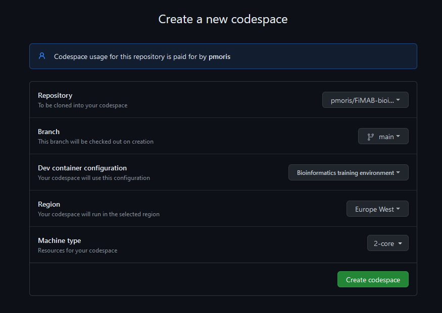
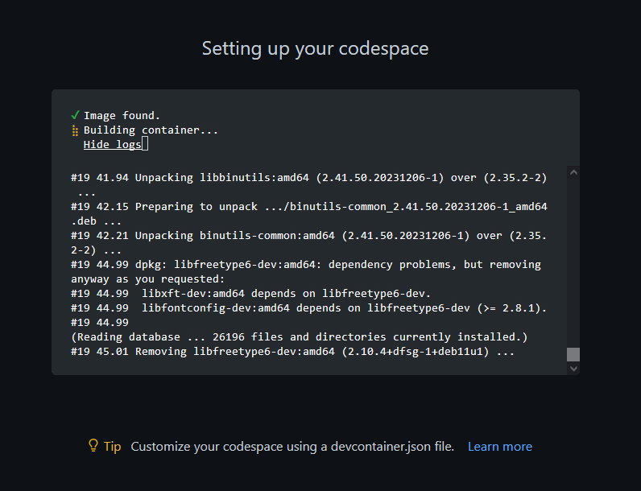
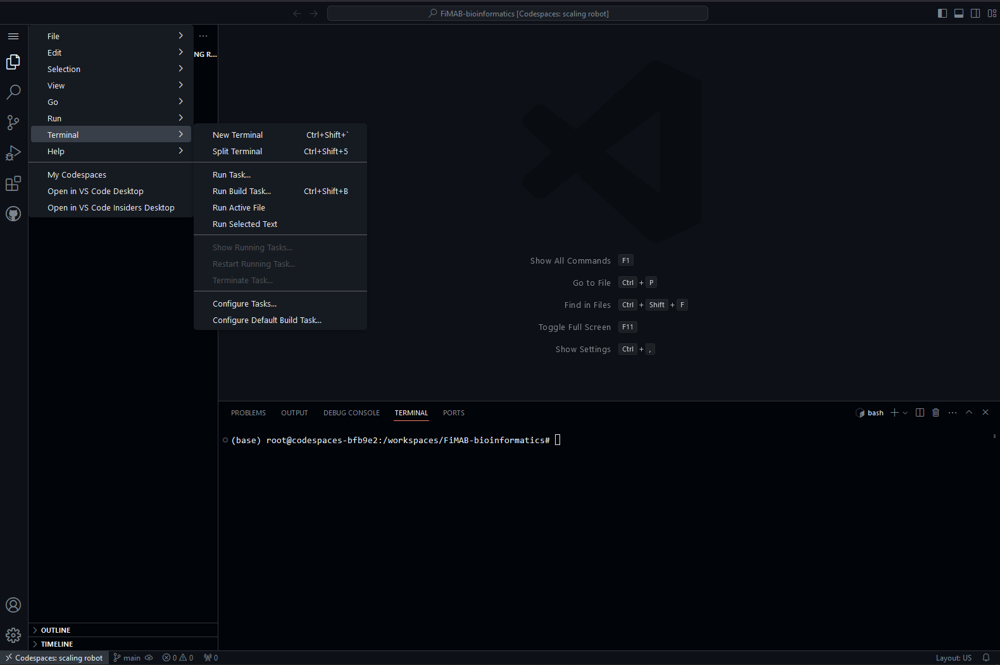
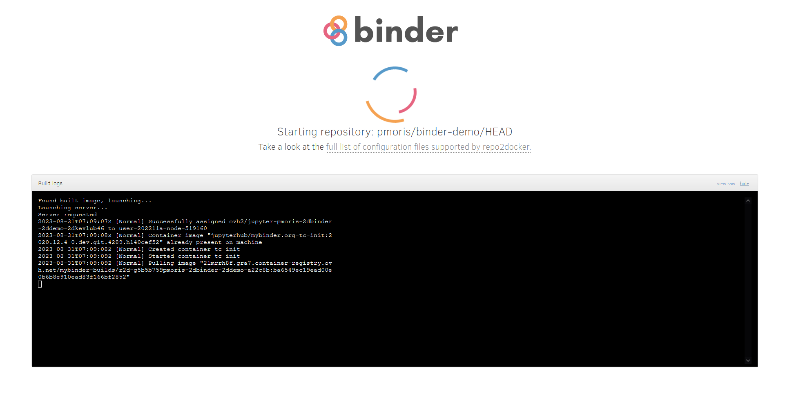
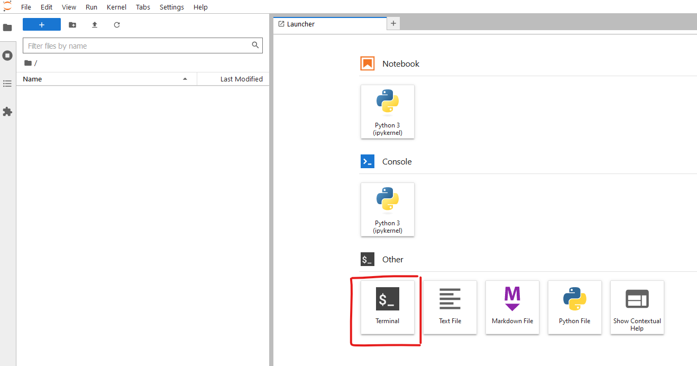
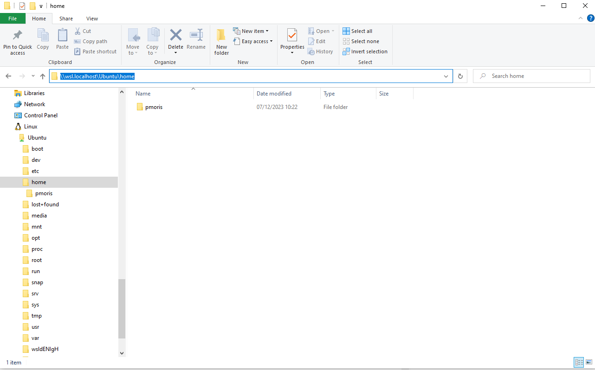

# Setting up your own Unix shell {#sec-unix-setup}

::: {.callout-warning}
For this iteration of the course, we will focus on using local unix environments, either WSL in Windows, or native shells in MacOS or Linux. You can ignore the instructions below.
:::

In order to get started, you need to get access to a Unix environment of your own. You can either work [locally](#local-unix-environment) on your own computer (see instructions [here](https://gist.github.com/pmoris/fdc953bbd6fec6d0ad98711376a61e21)) or you can use the [online environment](#online-linux-environment) that we have created for a previous iteration of this course. The latter comes with a `bash` shell and will immediately give you access to a bunch of files that we will use throughout the course and exercises.

There are also online playgrounds/simulations available to try out the Unix shell, for example [https://sandbox.bio/playgrounds/terminal](https://sandbox.bio/playgrounds/terminal). These are great to learn and we highly recommend checking out some of the tutorials on there, but the downside of course is that they are not true true environments and you cannot interact with your own files. You can use this site to follow along while learning some of the basic unix commands, but you will need to switch to a different option for the exercises eventually.

::: {.callout-note}
## Shortcut to online environments

- [Codespace](https://codespaces.new/pmoris/FiMAB-bioinformatics?template=false&devcontainer_path=.devcontainer%2Fdevcontainer.json)
- [Binder](https://mybinder.org/v2/gh/pmoris/FiMAB-bioinformatics/HEAD)

:::

## Online Unix environment

We have provided two different options for getting access to an online unix environment: through [Binder](https://mybinder.org/) (free, but less powerful) or through [GitHub Codespaces](https://github.com/features/codespaces) (free for 60 hours per month).

Both options will launch an environment containing all relevant training files, based on [this GitHub repository](https://github.com/pmoris/FiMAB-bioinformatics).

### GitHub Codespaces

To access Codespaces, you will first need to create a GitHub account via [https://github.com/signup](https://github.com/signup). Just follow the instructions and be sure to enable one of the [two-factor authentication options](https://docs.github.com/en/authentication/securing-your-account-with-two-factor-authentication-2fa/configuring-two-factor-authentication) (via a TOTP app like Authy, Google Authenticator or Microsoft Authenticator, or via text messages), otherwise you might not receive access to Codespaces.

Afterwards, you can click [this link](https://github.com/codespaces/new?machine=basicLinux32gb&repo=727651304&ref=main&devcontainer_path=.devcontainer%2Fdevcontainer.json&geo=EuropeWest), optionally change the region to the one closest to you under _change options_ (but leave the machine type on 2-core to remain eligble for 60 free hours!), and then press the _Create codespace_ button.





Setting up the codespace can take a while, but eventually you will be greeted by a VSCode environment. The terminal (a `bash` shell) is accessible at the bottom (or by pressing the hamburger icon in the top left and selecting "new terminal"). This is where you will be able to run the Unix commands introduced in the next chapters.



You will only receive 60 hours of free usage of Codespaces per month. This means you should manually shutdown your codespace whenever you are done with it. Otherwise it will keep running for 30 more minutes (by default). Just closing your browser will not shut down the workspace. Instead, you need to manually shut it down from within the codespace (by clicking the `><` button in the bottom left corner and selecting _stop current codespace_) or by browsing to [https://github.com/codespaces](https://github.com/codespaces) and shutting it down from that page.

::: {.callout-note}
## What are GitHub and `git`?

GitHub is a place to host code and software via a tool named `git`, which is a _version control system_. It allows you to keep track of the history of your code, easily revert changes and allows for collaborating with multiple people on the same project. We will not go into further detail on using version control, but for now just remember that it can play an important role in scientific reproducibility.

If you want to learn more about `git` already, you can have a look at the following resources:

- [https://happygitwithr.com/](https://happygitwithr.com/)
- [https://hwheeler01.github.io/CompBio/github/](https://hwheeler01.github.io/CompBio/github/)
- [https://pmoris.github.io/git-workshop/](https://pmoris.github.io/git-workshop/) (self-promotion)
:::

::: {.callout-note}
## What is GitHub CodeSpaces

Similar to Binder, Codespaces are development environments that are hosted in the cloud. This is a paid service provided by GitHub/Microsoft, which offers 60 hours of free usage per individual per month. Instead of Jupyter notebooks, Codespaces use code editors, like VSCode and Jetbrains IDEs, which come bundled with a `bash` terminal too.

You can find more info in the [GitHub Codespaces docs](https://docs.github.com/en/codespaces/overview).
:::

### Binder

As an alternative to CodeSpaces, we have also created a Binder environment. It will operate similar to CodeSpaces and provide you with an online environment containing all of the required files as well as a Unix shell (`bash`).

::: {.callout-note}
## What is Binder?

Binder is a service that allows people to share a customized compute environment based on a Git repository. It is mainly aimed at sharing Jupyter Notebooks (Python), but it also supports RStudio, Shiny and fortunately for us, a plain `bash` terminal too.

You can find more info on the [Binder website](https://mybinder.readthedocs.io/en/latest/introduction.html).
:::

To access the remote `bash` shell on Binder, browse to [https://mybinder.org/v2/gh/pmoris/FiMAB-bioinformatics/HEAD](https://mybinder.org/v2/gh/pmoris/FiMAB-bioinformatics/HEAD) and wait for the launcher to start. This process can take quite a while, so be patient.



Eventually, you should be greeted by a screen (Jupyter Lab) with a number of launchers. Simply select the one labelled "Terminal" (a black square with a white `$`) and you should be all set.



## Local Unix environment

If you are using MacOS or Linux, then you will already have access to a Unix shell (either `bash` or `zsh`, which will mostly behave identical for our purposes). To access it, simply search for a program called `Terminal` (or search for anything resembling "command", "prompt" or "shell").

In case you are using a Windows machine, things are slightly more complex and different methods exist, each with their own pros and cons. You could use a fully-fledged virtual machine like [VirtualBox](https://www.virtualbox.org/) to emulate a Linux machine within Windows. Or you could rely on the minimal `bash` emulator that comes bundled with [git for windows](https://gitforwindows.org/). However, nowadays we recommend that you use the [Windows Subsystem for Linux (WSL)](https://learn.microsoft.com/en-us/windows/wsl/), which was developed by Microsoft itself. In our opinion, it is one of the most polished methods to get access to a (nearly) full-featured Linux environment from within Windows, without the overhead of a full virtual machine or dual boot setup (dual boot means you install two different operating systems on your machine, and you switch between them when booting). For instructions on how to set it up, you can refer to [this section](#wsl-installation).

### Download the course files

Regardless of what type of local Unix environment you use, you will need to download the files that we will be using in our examples and exercises. You can do this directly on the command line or by manually downloading the files in the correct location.

1. Open your terminal and `cd` to a location where you want to place the training files.
2. Enter the command `git clone https://github.com/pmoris/FiMAB-bioinformatics.git`.
3. Afterwards, a new directory named `FiMAB-bioinformatics` will have been created.

It should look similar to this:

```
$ git clone https://github.com/pmoris/FiMAB-bioinformatics.git
Cloning into 'FiMAB-bioinformatics'...
remote: Enumerating objects: 7, done.
remote: Counting objects: 100% (7/7), done.
remote: Compressing objects: 100% (7/7), done.
remote: Total 7 (delta 0), reused 7 (delta 0), pack-reused 0
Receiving objects: 100% (7/7), done.
```

Alternatively,

1. Browse to [https://codeload.github.com/pmoris/FiMAB-bioinformatics/zip/refs/heads/main](https://codeload.github.com/pmoris/FiMAB-bioinformatics/zip/refs/heads/main)
2. Save the `.zip` file in a directory accessible by your Unix environment. For Windows/WSL, the easiest option is to choose the Linux file system (e.g., `\\wsl.localhost\Ubuntu\home\pmoris`), which is accessible by clicking the Linux/WSL entry in your explorer.
3. Extract/unzip the file.



### WSL installation

If you are using an updated version of Windows 10 (or 11), you should meet all the requirements and can simply follow the installation instructions listed here: [https://learn.microsoft.com/en-us/windows/wsl/install](https://learn.microsoft.com/en-us/windows/wsl/install). We recommend that you follow the instructions for WSL 2 (default), rather than the older WSL 1, and use the default Ubuntu 22.04 distribution (Linux comes in many different flavours, Ubuntu being one of the more popular ones).

Briefly:

- Open Windows PowerShell as administrator by right clicking your Windows Start Menu or searching for it in your list of applications.
- Type `wsl --install` and press enter.
- Afterwards, restart your PC.
- You can then launch WSL by searching for `wsl` or `Ubuntu` in your start menu.
- The first time you launch WSL, you will need to [configure it](#configuring-wsl).

If you use software like RStudio or VSCode, you can tell these programs to use WSL as their built-in terminal from now on, instead of Command Prompt.

::: {.callout-note}
### WSL1 vs WSL2

WSL 2 is the newer version of WSL 1. For most tasks, WSL 2 tends to be much faster, hence why we (and Microsoft) recommend using it in favour of the previous version. However, WSL 2 is only faster when you interact with files that are stored directly on the WSL file system, rather than working directly on the Windows file system. More info on the distinction between these file systems can be found [further below](#accessing-files-across-the-windows-and-wsl-file-systems) and [in Microsoft's WSL documentation](https://learn.microsoft.com/en-us/windows/wsl/filesystems).

You can switch between WSL1 and WSL2 on the fly by just calling `wsl --set-version <distro_name> 2` (or 1) in PowerShell, so feel free to experiment for yourself.

For a full overview of the differences, check out: [https://docs.microsoft.com/en-us/windows/wsl/compare-versions](https://docs.microsoft.com/en-us/windows/wsl/compare-versions).
:::

#### Configuring WSL

Microsoft also provides an excellent tutorial on setting up your WLS environment, which you can find [here](https://learn.microsoft.com/en-us/windows/wsl/setup/environment).

---

After installing WSL and a Linux distribution, you will have access to it via its own built-in terminal emulator. It should be located in your Windows Start Menu with a name corresponding to the distribution that you installed, e.g. `Ubuntu 20.04 LTS`, or simply `wsl`.

The first time you run WSL, you will need to setup a Linux username and password. Note that while you are entering a password, nothing will appear on the screen, but this is intended (blind typing). The username will determine, among other things, the name of your home folder, whereas the password will grant you administrator rights (referred to as super users or admins in Linux land; the `sudo` command is used to invoke these rights, see @sec-unix-sudo).

You will also need to upgrade the packages by running the following command: `sudo apt update && sudo apt upgrade`, followed by your password.

For more information, check the [docs](https://learn.microsoft.com/en-us/windows/wsl/setup/environment#set-up-your-linux-username-and-password).

#### Accessing files across the Windows and WSL file systems

::: {.callout-note}
Some of the information below might be a bit confusing at this point, but things should become more clear after working your way through the Unix section of this course.
:::

Newer versions of WSL will automatically add a shortcut to the WSL file system in your Windows File Explorer (look for Tux, Linux' penguin mascot). The file path will look similar to `\\wsl$\Ubuntu\home\<user name>\Project`, indicating that Windows treats the WSL file system as a sort of network drive. You can also open a file location in Windows File Explorer from within a WSL terminal (e.g. after you browse to a particular directory `cd ~/my-project`) by simply using the command `explorer.exe .` (don't forget the dot!).

Vice versa, you can also access the Windows file system from within WSL because it is mounted under `/mnt/c`. So, you could for example do something like `cp /mnt/c/Users/<user name>/Downloads/file-downloaded-via-webbrowser ~/projects/filename`.

More information can be found in the [WSL documentation](https://learn.microsoft.com/en-us/windows/wsl/filesystems).

#### Windows Terminal

Even though WSL comes with its own terminal application, it is rather bare-bones and can make some operations like copying and pasting via `CTRL+C`/`CTRL+V` a bit tricky (you will need to use `CTRL+SHIFT+C` to copy and right mouse click to paste). Fortunately, Microsoft has also been working on a new terminal emulator that is much nicer to work with. Meet the [Windows Terminal](https://learn.microsoft.com/en-us/windows/terminal/install).
