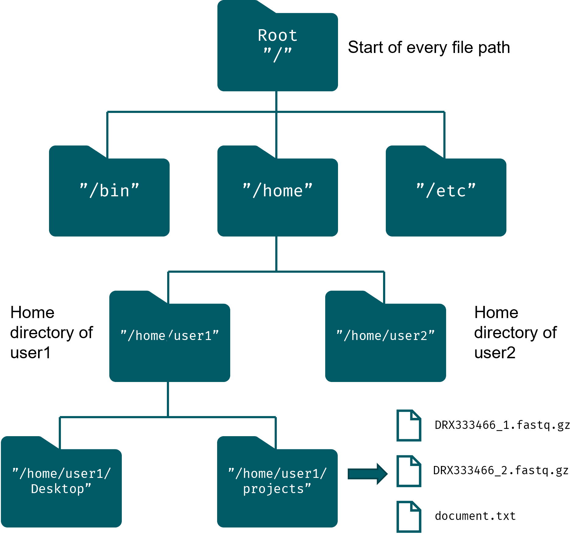

# Navigating the Unix file system

::: {.callout-note}
## Prior experience

You can skip this section and proceed directly to the exercises if you are already familiar with the Unix directory structure and basic commands like `cd` and `ls`.
:::

::: {.callout-tip}
We have provided a list of helpful tips and hints in the appendix: @sec-unix-tips. Have a look already and refer back to it after you have worked your way through the next sections on navigation and basic commands.

Additionally, there is an overview of some of the most common symbols that are used by the Unix shell here: @sec-table-special-syntax.
:::

## Layout of the Unix file system {#sec-linux-paths}
All files and directories (or folders) in Unix are stored in a hierarchical tree-like structure, similar to what you might be used to on Windows or Mac (cf. File Explorer). The base or foundation of the directory layout in Unix is the _root_ (`/`) (like the root of a tree). All other files and directories are built on top of this root location. When navigating the file system, it is also important to be aware of your current location. This is called the _working directory_.

The address of a particular file or directory is provided by its _filepath_: this is a sequence of location names separated by a forward slash (`/`), like `/home/user1`. Note that this differs from the convention in Windows, where backslashes (`\`) are used in file paths instead.

There are two types of file paths: _absolute_ and _relative_ paths.

- Absolute file path: this is the exact location of a file and is always built up from the root location. E.g., `/home/user1/projects/document.txt`.
- Relative file path: this is the relative address of a file compared to some other path. E.g., from the perspective of `/home/user1`, the file `document.txt` is located in `projects/document.txt`.



### Home sweet home: `~`

Another important location is the _home_ directory. In general, every user has their own home directory, found in `/home/username`. A frequently used shortcut for this is the tilde symbol (`~`). Depending on the current user, this will refer to a particular directory under `/home/.`.

::: {.callout-tip collapse="true"}
## How can `user1` write the file path to `document.txt` using the `~` shortcut?

```bash
~/projects/document.txt
```
:::

### Where am I? `.` shortcuts

The dot (`.`) also has an important function in file paths:

- `.` represents the directory you are currently in, i.e. the working directory.
  - E.g., while inside the `projects` directory, any files inside can be accessed using either `filename` or `./filename`.
- `..` represents the parent directory of the working directory.
  - E.g., from `/home/user1/Desktop`, the relative path to file `document.txt` can be written as `../projects/document.txt`.
  - These expressions can be nested; while inside the `projects` directory, `../../user2` can be used to access the `user2` home directory.

## Moving around the file system

In this section we will introduce a few essential commands that allow you to navigate the file system: `pwd`, `cd` and `ls`.

### `pwd`: avoid getting lost

`pwd` stands for _print working directory_ and it does exactly that: it allows you to figure out where you are in the file system. For example, in the figure above, `user1` would generally find themselves in their home directory upon login:

```bash
$ pwd
/home/user1
```

### `cd`: on the move

Next, there is the `cd` command. This is used to move between directories (the name derives from _change directory_). Simply follow the command name by a file path to navigate there: `cd <filepath>`. To move from `user1`'s home directory to the `projects` directory:

```bash
cd projects
```

Note that you can use the special symbols we saw earlier as navigational shortcuts:

|     Command    |      Result                                                 |
|----------------|-------------------------------------------------------------|
|     `cd ~`     |     Change to home directory (`/home/username`)             |
|     `cd ..`    |     Change to parent directory (e.g., go up 1 directory)    |
|     `cd /`     |     Change to the root location                             |

### `ls`: show me what you got

Finally, we have the `ls` command. Its name stands for _listing_ and it will list the names of the files and directories in the current working directory. The basic structure of the command `ls [OPTIONS] <target>`, with `<target>` being an optional path to a directory.

To continue upon our previous example, from inside `/home/user1/projects` we would see:

```bash
$ ls
DRX333466_1.fastq.gz    DRX333466_2.fastq.gz    document.txt
```

Note that we did not specify a path, in which case `ls` will just list the contents of the current working directory. If we do specify a path, we will of course be shown the contents of that particular location:

```bash
$ ls /home
user1   user2
```

By default, the files and directories are listed in alphabetically order and depending on your terminal settings, files and directories might even be colour-coded differently.

`ls` also comes with a few handy optional flags to modify its behaviour:

|     Command    |      Result                                                 |
|----------------|-------------------------------------------------------------|
|     `ls -l`    |  Show detailed list view    |
|     `ls -hl`    |  Show detailed list view and print file sizes in a human readable format   |
|     `ls -a`     |  List all files and directories, including _hidden_ ones |
|     `ls -lha`     |  Combine all options into one command |
|     `ls --help`     |  Show more information on the ls command and its options |
| ls

::: {.callout-note}
## What are hidden files?

Earlier, we mentioned that `.` is used to refer to the current working directory, but it actually has a second function as well. Any file or directory name that starts with a dot (like `/home/user1/.ssh`) will be hidden and not displayed by default when using `ls`, hence the need for the `-a` flag.

Linux often hides system or configuration files to avoid cluttering up your (home) directory. We will not deal with hidden files directly in this course, but one of the situations where you might encounter them are when modifying your `.bashrc` file (e.g., when creating custom functions, aliases or tweaking your `PATH` @sec-unix-path) or when managing SSH keys for remote server access @sec-ssh).
:::

The `ls -l` command is particularly useful, because it shows all types of additional information.

::: {.callout-tip collapse="true"}
## What do the different columns in the output of `ls -l` represent?

```bash
$ ls -l
total 83764
-rw-r--r-- 1 pmoris pmoris 14367565 Dec  7 09:39 3B207-2_S92_L001_R1_001.fastq.gz
-rw-r--r-- 1 pmoris pmoris 16622378 Dec  7 09:39 3B207-2_S92_L001_R2_001.fastq.gz
-rw-r--r-- 1 pmoris pmoris 13592342 Dec  7 09:39 MRA1242_S28_L001_R1_001.fastq.gz
-rw-r--r-- 1 pmoris pmoris 15821981 Dec  7 09:39 MRA1242_S28_L001_R2_001.fastq.gz
-rw-r--r-- 1 pmoris pmoris 12131772 Dec  7 09:39 NK6_S57_L001_R1_001.fastq.gz
-rw-r--r-- 1 pmoris pmoris 13226198 Dec  7 09:39 NK6_S57_L001_R2_001.fastq.gz
```

The first column represents the permissions of the files/folders. In a nutshell, these determine things like who can read or write (= modify, including deletion) particular files. There is a column for the owner, a group of users and everyone else. There is more info in the appendix (@sec-permissions). The next column showing a `1` for each entry, you can ignore for now (they represent hard links, a concept we will not dive into). The two names in the following columns are the _user_ and the _group_ owner of the file. Next is the size of the file in bytes. If we had used the `-h` flag, the size would have been shown in KB, MB or GB instead. Next we have the time of the last modification and finally the name of the file/directory.
:::

---

::: {.callout-note}
In the exercises below, we use paths relative to whatever directory your `training` directory was stored in!
:::

## Exercises

1. Navigate to your home directory and list all the files and folders there. Try typing the path with and without using the `~`. Rely on tab-completion to assist you and avoid typos (@sec-unix-tips).
2. Print the name of the current working directory to your screen.
3. List the contents of the `./training/data/fastq/` directory of the course files, without first moving there. Experiment with absolute and relative paths.
4. What is the most recent modification date of the file `Homo_sapiens.GRCh38.dna.chromosome.Y.truncated.fa` found in the `./training/unix-demo/` directory?
5. Try to search for the file `penguins.csv`: what is the absolute path to it on your machine?
6. Navigate to `./training/data/fastq/` to make it your working directory (double check using `pwd`!). What is the relative path to the `penguins.csv` file from here?
7. Suppose your working directory is still `./training/data/fastq/`. What will the result of `pwd` be after running each of the following commands in succession?
  - `cd ../`
  - `cd ../unix-demo/`
  - `cd files_to_loop_through/../../data/..`
  - `cd /`
  - `cd ~`

---

## Summary

::: {.callout-tip collapse="false"}
## Overview of concepts and commands

- *Absolute* versus *relative* file paths
- Root (`/`) and home directory (`~`)
- `.` represents the current working directory
- `..` represents the parent directory
- `pwd`: print the path of the current working directory
- `cd <path>`: navigate to the given directory
- `ls <path>`: list files and directories in the given location
- Hidden files contain a `.` at the start of their name and are not visible by default

:::
