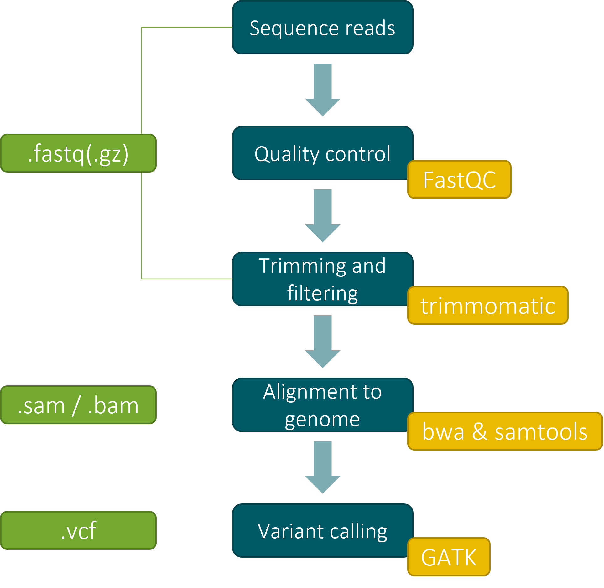

# Variables, loops and scripts

::: {.callout-tip}
Remember that we have provided a list of helpful tips and hints in the appendix: @sec-unix-tips.
:::

## Variables

_Variables_ are placeholder names to refer to specific values. You can use them as shortcuts to refer back to a specific value or file path. Moreover, they are easy to set and re-use in bash scripts, which we'll introduce later. To set a variable, we assign a value to a name using the equals sign `=`. Afterwards, we can always recall the value via the variable's name, prefixed with a dollar sign `$`. While not strictly necessary, it is good practice to also enclose the name of the variable in `{}`, because it makes creating new variable names a lot easier during scripting.

```bash
$ my_value="Plasmodium falciparum"

$ echo ${my_value}
Plasmodium falciparum
```

As before, we use spaces around the value that we are assigned to the variable. This allows us to use spaces and other special characters inside our value. The variable in our example was a piece of text (a string), but we can also store things like integers (`x=101`) or booleans (`true`/`false`).

The main reason we introduced the concept of variables is because they play an important role in (for) loops, so let us move on to that topic now.

## Loops

Loops provide a powerful method of repeating a set of operations multiple times. They are integral to automation and being able to process large numbers of samples in bioinformatics pipelines, but also very convenient for performing other tasks like renaming a bunch of files. The idea is a bit similar to the concept of globbing, but loops offer a lot more flexibility and control over the process.

The most common type of loops are probably _for loops_:

```bash
$ for nucleotide in A C T G \
> do echo ${nucleotide} \
> done
A
C
T
G
```

There are a number of different things going on here:

- The for loop consists out of three different sections:
    1. `for nucleotide in A C T G`: this tells bash that we want to start a for loop. It also defines the range of values that our loop will iterate over, in this case the characters `A`, `C`, `T`, and `G`. Finally, it creates a new variable called `nucleotide`. During every pass or round of the loop, its value will change to one of the values defined in the loop's range.
    2. `do echo $i`: this is the body of the loop. It always starts with `do` and is then followed by one or more commands. In the body, you can make use of the loop variable `$nucleotide`.
    3. `done`: this notifies bash that the body and loop definition end here.
- This is the first time that we see a multi-line bash command, where we split across new lines using a backslash symbol (`\`). We could have just as well written this statement on a single line (`for i in a c t g; do echo $i; done`), using colons (`;`) to mark the end of each section of the loop.

Instead of looping over a set of words, we can also loop over a range of values:

```bash
$ for i in {1..3} \
> do echo ${i} >> loop.txt \
> done

$ cat for_loop.txt
1
2
3
```

Also note that we used a different name for our loop variable this time around; you can use any name you like, but `i` is a very common placeholder. To make your scripts easier to read, it is good to stick with a reasonable short, but informative name.

::: {.callout-tip collapse="true"}
## As a reminder, what would have happened if we had used `>` instead of `>>`? (Click me to expand!)

The for loop `for i in {1..3}; do echo ${i} > loop.txt; done` is basically equivalent to running the following three commands one after another:

```bash
echo 1 > loop.txt
echo 2 > loop.txt
echo 3 > loop.txt
```

As we saw in the previous sections, the redirection `>` will always overwrite the contents of its destination file. So in this case, the file would only contain the final number of the loop, namely 3. Loops always run in the order defined in their range.
:::

Another common for loop pattern is the following one, which is used to loop over a set of files. It combines the for loop syntax with glob patterns (@sec-globbing):

```bash
$ ls ./directory
sample_1_R1.fastq   sample_1_R2.fastq   text_file.txt

$ for fq in ./directory/*.fastq; do wc -l ${fq}; du -h ${fq}; done
582940 ./directory/sample_1_R1.fastq
67M     ./directory/sample_1_R1.fastq
462334 ./directory/sample_1_R2.fastq
54M     ./directory/sample_1_R2.fastq
```

There are a few important things to note here:

1. The glob pattern `./directory/*.fastq` will be expanded by the shell to a list of all files ending with `.fastq`. Consequently, the for loop will only iterate of the FASTQ files and the `.txt` file is ignored.
2. Inside the execution statement of the loop, the current file is referred to via the variable `${fq}`.
3. We used a semicolon (`;`) to write the loop statement on a single line.
4. Unlike the previous example, the body of this for loop contains multiple commands: first the filename is printed to the screen using `echo`, then the number of lines in the file is printed to the screen.

---

Loops, combined with scripting, are incredibly useful when performing more advanced operations, like performing the bioinformatics analysis of DNA sequencing reads. For example, to process the DNA reads generated by an AmpliSeq assay and identify the genetic variants (variant calling analysis), the following steps would be performed by looping over the FASTQ file corresponding to each sample:

```
for every FASTQ file:
    1. Perform a quality control step
    2. Map the reads to the reference genome
    3. Call the variants in the alignment
```

---

There actually exists another type of loop, namely the _while loop_. These behave similar, but instead of going through a list of items or a range of numbers, the loop will continue for as long as a certain condition is met. You can find more information [here](https://pressbooks.senecacollege.ca/uli101/chapter/while-loop-in-bash/) in case you are interested.

## Shell scripts

All the topics that we have covered so far, were performed interactively on the command line. However, we can also write scripts that contain a series of commands, loops and variables, which can be executed in one go. That way, you can queue up a bunch of long-running processes and don’t need to stick around to start up each next step in the process. Moreover, it allows you to reuse the same set of operations in the future. Scripts can even be written in such a way that they can be called using different options, similar to how we can provide different optional arguments to `bash` commands.

### Creating a bash script

Shell scripts are nothing more than [executable](#sec-executable-script) text files written in a specific scripting language, in our case `bash`. We can write bash scripts in any type of text editor (like Notepad or VS Code), but we can also do it directly on the command line, by making use of an editor like `nano` or `vim`.

The only requirements for bash scripts is that the first line contains a shebang directive, like `#!/usr/bin/env bash`. When the script is executed, this line tells your machine to run the script using the `bash` interpreter (i.e., that it is a `bash` script and needs to be treated accordingly). By convention, shell scripts are saved with the `.sh` extension.

### Running scripts

A very simple script might look a bit like this:

```bash
#!/usr/bin/env bash

echo "My first script!"
```

Inside a script, you can use any valid `bash` statement that would work on the command line. This includes all the commands we introduced up until now, structures like for loops, output redirection, pipes, etc.

To run a bash script, you can simply execute the `bash` command and point it to a script. If we save the two lines above to `script.sh` file and then executing it by running `bash script.sh`, the single command inside of it will be executed and printed to the screen:

```bash
$ bash script.sh
My first script!
```

Below is a slightly more complex example:

```bash
#!/usr/bin/env bash

echo "This is an example script."

echo "The script was executed from the directory: "
pwd

# this is a comment

echo "Running a for loop"

for i in {1..5}
        do echo i
done

echo "This is a grep command"

# long commands can be split over multiple lines
# this grep command counts the number of times "tttataaaaaaac"
# occurs in the current directory and all of its subdirectories
# while ignoring case
grep -i \
        -r \
        "tttataaaaaaac" \
        .
```

::: {.callout-tip}
Note that the indentation that we used is not strictly necessary for loops to work, but it does help with legibility and it is common practice to do this, especially in scripts.

You can use hashes (“#”) to comment out a line. Use this to describe what your code is doing. Your future you will be grateful!

You can also use backslash (“\”) to split a long command over multiple lines, making it easier to read your script. E.g., for listing `-options` on consecutive lines.
:::

If we save and run the script above, we get the following output.

```bash
This is an example script.
The script was executed from the directory:
/home/pmoris/itg/FiMAB-bioinformatics/training/unix-demo
This is a for loop
i
i
i
i
i
This is a grep command
./PF0512_S47_L001_R1_001.fastq:CTAACTACAATGAAGACAAAAATATTATGTATATGTACCCAAATGAACCAAATTATAAGGATTCCAAAAAAGTATTATCTCAAAAAAAAAAAAAAAAAATCCACCATACATCATTTTCATCGTATTAATTCCCATGGACCACCTACACATGTGCAATTTATAAAAAAACAACAATCCCACTATCTCTAATACACATCTCCGAACCCACGAGACGCCGGACAATACCGTTTGCCAGCTCCCCGTACAATAAACCAATACTAAGATCATTGCCTCACTCTGAATCGCAGAACTCTGACGTATA
./PF0512_S47_L001_R1_001.fastq:CTAACTACAATGAAGACAAAAATATTATGTATATGTACCCAAATGAACCAAATTATAAGGATTCCAAAAAAGTATTATCTCAAAAAAAAAAAAAAAAAAAAAAAAAAAAAAAAAAAATTAAAAAAAAAAAATAAAAAAAAAAAAAATAAAAAAAAAAAAAAAAAAAAAAAAAATAAAAAAAAAAAAATAAAAAAAAAAAAAAAAAAAAAACAAAAACACAACAAAAACAAAAAATAAAATATATATTTATAAAAAAACAAAAAAAAGAAAACAACACAGACACTCAAACAACAACACACCA
./Homo_sapiens.GRCh38.dna.chromosome.Y.truncated.fa:TGAGATTGGATTTTTAAACATTAATATGGCGTGTTACATTTATAAAAAAACCCCAAAGAT
./my_script.sh:# this grep command counts the number of times "tttataaaaaaac"
./my_script.sh: "tttataaaaaaac" \
Exiting script
```

::: {.callout-warning collapse="true"}
## Can you spot what is wrong with this script? (Click me to expand!)

The output of the for loop section of the script is five lines of the character "i", which is not what we wanted. The problem is that inside of the body of the for loop, we used the character "i", instead of referencing the for loop variable using `${i}`.
:::

Lastly,  note that not all scripts are `bash` scripts, you can also create R, Python or other types of scripts.

### Making scripts executable {#sec-executable-script}

In the previous examples we ran scripts by invoking them using the `bash` command. However, we can also make the file _executable_ by using the `chmod` command. Once a file has been marked as executable for a given user, it can be run by simply typing the file name, without any other command in front.

```bash
$ ls -l my_script.sh
-rw-r--r-- 1 pmoris pmoris 488 Jan  4 14:35 my_script.sh

$ chmod +x my_script.sh

$ ls -l my_script.sh
-rwxr-xr-x 1 pmoris pmoris 488 Jan  4 14:35 my_script.sh

$ my_script.sh
<script output>
```

You can read more about file permissions in @sec-permissions.


::: {.callout-note}
## Different methods of running script

There are actually a few different ways to execute a shell script:

1. Prefixing the interpreter: `bash path/to/script.sh`. For this method, we explicitly execute the `bash` command and point it to the location of a script.
2. Directly running a script in the current working directory: `./script.sh`. This option has two requirements: first, the file needs to be made executable (as we saw above). Furthermore, as a safety precaution, we need to prefix the name of the file with `./`, to let the system know that we are trying to run a script that resides in the current working directory, as opposed to one that is globally accessible.
3. Directly running a globally accessible script: `script.sh`. This option also requires the file to be executable, but on top of that it will only work for files that are found in the list of directories making up your `PATH` (see @sec-unix-path). These are pre-defined (or custom) directories like `/usr/bin` that usually store all the common commands that we have used until now, as well as any other software that you might install yourself.

:::

## Overview of variant calling pipeline

The chart below provides a high-level overview of the steps involved in a basic variant calling pipeline. Throughout the course, we have already introduced some of the file formats that are used (green). We will explore these steps and the associated tools, in more detail during the in-person courses later on.



For now though, we have included a few example scripts that run through the above steps, to showcase how the building blocks that we have learned so far can be used to orchestrate a more complex analysis.

::: {.callout-note}

Inspect the scripts stored in `./training/scripts` and try to make sense of the general steps that they describe. You can gloss over the specifics of what the specialized commands like `fastqc` or `bwa mem` do; instead, try to focus on the general structure and syntax of the scripts, the use of patterns like for loops, directory navigation, how arguments are provided to commands, etc.

:::


::: {#tip-basename .callout-tip collapse="true"}
## What does the following line do? `sample_name=$(basename ${read_1} _R1_001.fastq.gz)` <br> Hint: `$(command)` provided a method to run a command inside another statement, so try figuring out what the command between the brackets does first.

This line is present in most of the example scripts inside of a for loop that iterates over a set of FASTQ files, each time processing a pair of `R1/R2` files.

```
# first navigate to the directory containing fastq files
cd ./training/data/fastq/

# loop over pairs of fastq files
for read_1 in *_R1_001.fastq.gz
do
    sample_name=$(basename ${read_1} _R1_001.fastq.gz)
...
```

During each iteration of the loop `${read_1}` will correspond to the file path of a specific FASTQ file.

When we call `basename` on it with the extra argument `_R1_001.fastq.gz`, we will receive back the name of the file with that suffix removed. E.g.:

```bash
$ basename PF0080_S44_L001_R1_001.fastq.gz _R1_001.fastq.gz
PF0080_S44_L001
```

The last step we do is running this command inside a command substitution: `$(command)`. When using a command substitution, the output of the command inside the brackets will just be passed along to the command line. In our case, we try to assign the value `$(basename ${read_1} _1.fastq.gz)` to a new variable named `sample_name`. The value will then contain the output of its command substitution, namely `PF0080_S44_L001`.

After running the above statement, we now are able to more easily construct the name of the first and second read pair:

```
$ echo ${read_1} ${sample_name}_R2_001.fastq.gz
PF0080_S44_L001_R1_001.fastq.gz PF0080_S44_L001_R2_001.fastq.gz

```

The first read we already had, but to create the second one we concatenate the sample name with the new suffix `_R2_001.fastq.gz`.

Paired sequence data is usually named in such a way that it allows to access pairs of files in this way.
:::

## A few final useful scripting concepts


### Command substitution

In the callout box above we already introduced the concept of using _command substitutions_ and the `basename` command to manipulate filenames and paths during a for loop, in order to be able to iterate over pairs of FASTQ files with similar, but predictable file names (e.g., `read_R1_001.fastq` and `read_R2_001.fastq`). To reiterate, the general concept is that we only loop over R1 of each pair, use `basename` to extract the filename without the `R1_001.fastq.gz` suffix _and_ without the preceding file path prefix, and then use this to construct the known file path to R2.

```
for read_1 in *_R1_001.fastq.gz
do
    sample_name=$(basename ${read_1} _R1_001.fastq.gz)

    command ${read_1} "/file/path/to/${sample_name}_R2_001.fast.qz"
...
```

A simpler example would be letting echo output the result of another command, like `date`:

    echo "Today is $(date)."

You can also use it to store the output of a command in a variable, like we did for `basename`:

    count=$(grep -c "#" variants.vcf)

### Parameter expansion - manipulating strings

Bash contains all sorts of tricks to manipulate strings of text. These can be used in a similar way to `basename`, in order to strip of file extensions, parts of names or file paths and many other more complex tasks. For more details, we refer to [https://mywiki.wooledge.org/BashFAQ/073](https://mywiki.wooledge.org/BashFAQ/073).

## Exercises

1. Create a for loop over the files in `./training/unix-demo/files_to_loop_through` that prints the first line of each file to the screen.
2. Create a bash script that does the same thing.
3. On a single-line, run the script, but sort its output in reverse order (check `sort --help` to check how) and store the new output in a file called `loop_sort.txt`.
4. Create a bash script with a for loop that prints the name of each read file in the `./training/data/fastq` directory.
5. Modify the previous bash script so that it also 1) creates a single new directory named `fastq_meta` and 2) creates a new file in that directory, one for each FASTQ file, which contains two lines: the first with the number of lines in the FASTQ file and the second with its file size.
6. Create a bash script with a for loop that prints the sample name for each pair of reads in the `./training/data/fastq` directory (i.e., half as many names as in the previous exercise).
7. Make a script that prints the length of every read in the `./training/data/fastq` files, and stores this information in a file. The output should be sorted descending (largest reads first). Tip, there are multiple ways to count the number of reads in a fastq file, but you can check the `seqtk` or `seqkit` tools, and more specifically the `seqtk comp` or `seqkit stats` commands.
8. Create a bash script that:
    - Counts the number of header lines in `./training/unix-demo/ampliseq-variants.vcf` and store this number as a variable.
    - Extracts the contents of the VCF file after the header lines (i.e., the tabular section) and store it in a separate file.
    - Creates a for loop to extract the first eight columns and store them each in a separate file named `vcf_column_#.txt` (where `#` is the column number).


## Summary

::: {.callout-tip collapse="false"}
## Overview of concepts and commands

- Variables can be assigned via `name=value` and referenced via `${name}`
- For loops are used to iterate over a list of items or files
- Scripts can be used to combine multiple commands into a single set of instructions that can be re-used.
- Manipulating file names during a loop can be done using `basename` or parameter expansion.
- Command substitutions (`$(command)`) can be used to insert the output of a particular command (e.g., `basename`) into the middle of other commands or during the construction of new strings of text.

:::
